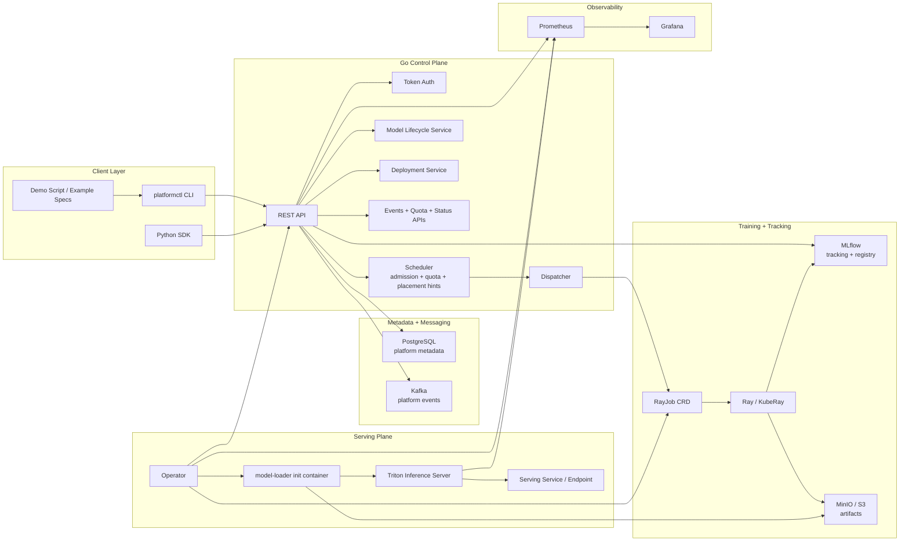
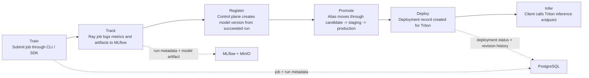
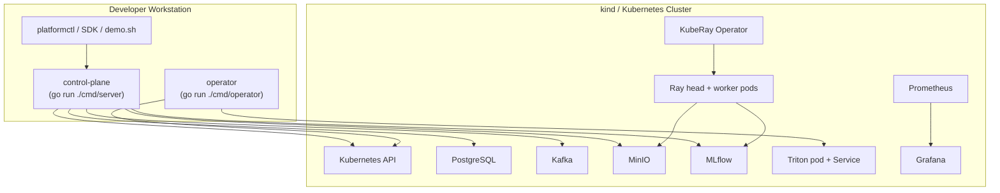

# kubernetes-native-ai-platform

A Kubernetes-native AI/ML platform for end-to-end ML workflow orchestration.

**train → track → register → promote → deploy → infer**

Signals both **AI Infrastructure** (Kubernetes orchestration, distributed training, model serving, observability) and **ML Platform** (experiment tracking, model registry, promotion workflows, developer CLI) engineering.

## Architecture

The design keeps orchestration and metadata ownership in Go, uses MLflow for experiment tracking and model registry, and uses Triton as the serving runtime.

| Layer | Technology |
|-------|-----------|
| Control plane | Go (chi, PostgreSQL, Kafka) |
| Training runtime | Ray + KubeRay |
| Experiment tracking | MLflow |
| Serving | Triton Inference Server |
| Artifact store | MinIO (local) / S3 (cloud) |
| Observability | Prometheus + Grafana |
| Orchestration | Kubernetes (kind locally) |

### System Context



### Lifecycle Flow



### Local Development Topology



### Design Notes

- Control-plane ownership stays in Go. Validation, state transitions, scheduling, metadata persistence, and API behavior do not move into Python services.
- MLflow remains mandatory for the `track -> register -> promote` path.
- Triton remains the only serving runtime for the `deploy -> infer` path.
- PostgreSQL is the platform system of record for jobs, runs, models, deployments, revisions, and events.
- Kubernetes owns workload runtime state; the platform reconciles that state back into PostgreSQL through the operator.

See [`docs/architecture/`](docs/architecture/) for sequence diagrams.

## Quick Start

```bash
# 1. Start the full local stack (kind cluster + all services + KubeRay)
make local-up

# 2. Build demo training images (once)
make -C infra/local demo-images

# 3. Start control plane + operator (two terminals)
cd control-plane && go run ./cmd/server
cd operator && go run ./cmd/operator

# 4. Build the CLI
cd cli && go build -o platformctl . && export PATH=$PWD:$PATH

# 5. Run the end-to-end demo
export PLATFORMCTL_HOST=http://localhost:8080
export PLATFORMCTL_TOKEN=demo-tok-abc123   # must start with "demo-tok" — see local-setup.md
export PROJECT_ID=$(kubectl exec -n aiplatform deploy/postgres -- \
  psql -U aiplatform aiplatform -t -A \
  -c "SELECT id FROM projects WHERE name='vision-demo' LIMIT 1")
bash examples/demo-clients/demo.sh
```

See [`docs/runbooks/local-setup.md`](docs/runbooks/local-setup.md) for detailed setup.

## Demo

Nine-act scripted demo covering all portfolio requirements:

1. Submit distributed training job
2. Ray workers running on Kubernetes
3. MLflow run with metrics and artifact
4. Register model version
5. Promote to `production` alias
6. Deploy to Triton
7. Inference requests
8. Metrics and deployment health (Grafana)
9. Failure scenario and recovery

```bash
bash examples/demo-clients/demo.sh          # run
bash examples/demo-clients/record.sh        # record with asciinema
DEMO_MODE=full bash examples/demo-clients/demo.sh  # use real ResNet50
```

See [`docs/runbooks/demo-walkthrough.md`](docs/runbooks/demo-walkthrough.md).

## Testing

```bash
cd control-plane && go test ./...                                           # unit + integration
cd control-plane && go test ./internal/api/... -run TestE2E -v             # E2E lifecycle
cd operator && go test ./...                                                # operator tests
cd cli && go test ./...                                                     # CLI tests
cd sdk/python && python -m pytest tests/                                    # SDK tests
```

## Repository

```
control-plane/   Go REST API — orchestration, metadata, auth, scheduling
operator/        Kubernetes reconciler (RayJob + Triton)
cli/             platformctl CLI
sdk/python/      Thin Python SDK
training-runtime/ Training scripts + Docker images (minimal MLP + ResNet50)
examples/        Specs, demo script
docs/            Architecture diagrams, runbooks
infra/           kind config, Kubernetes manifests, Helm
observability/   Prometheus rules, Grafana dashboards
```
