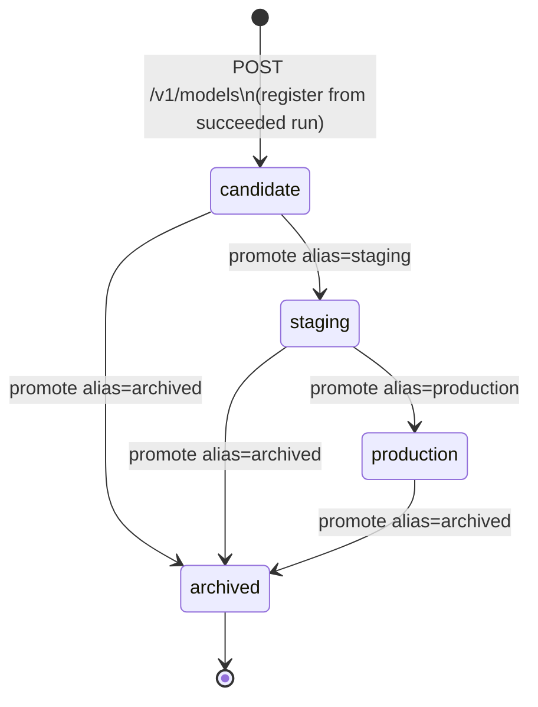

# Model Lifecycle

**Promotion rules:**
- `archived` is terminal — cannot be re-promoted (returns 409)
- Promoting a version to `production` demotes the prior `production` version to `staging`
- Only `production`-aliased versions can be deployed
