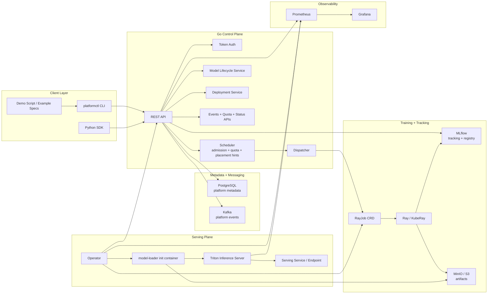
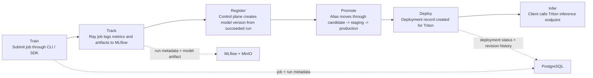
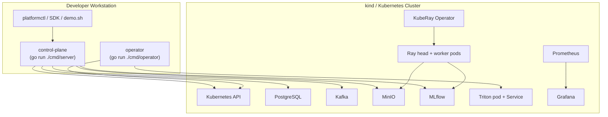

# System Architecture Overview

This platform is a Kubernetes-native AI/ML control plane built around the required lifecycle:

`train -> track -> register -> promote -> deploy -> infer`

The design keeps orchestration and metadata ownership in Go, uses MLflow for experiment tracking and model registry, and uses Triton as the serving runtime.

## Business Context

- Purpose: demonstrate AI infrastructure and ML platform engineering with a complete model lifecycle.
- Primary users: platform engineers, ML engineers, and developers running the local portfolio demo.
- Core value: provide a single control plane for training submission, model registration, promotion, deployment, and inference.
- Operating model: CPU-first local development on kind/k3d before cloud-oriented variants.

## System Context

## Lifecycle Flow

## Local Development Topology

## Design Notes

- Control-plane ownership stays in Go. Validation, state transitions, scheduling, metadata persistence, and API behavior do not move into Python services.
- MLflow remains mandatory for the `track -> register -> promote` path.
- Triton remains the only serving runtime for the `deploy -> infer` path.
- PostgreSQL is the platform system of record for jobs, runs, models, deployments, revisions, and events.
- Kubernetes owns workload runtime state; the platform reconciles that state back into PostgreSQL through the operator.
