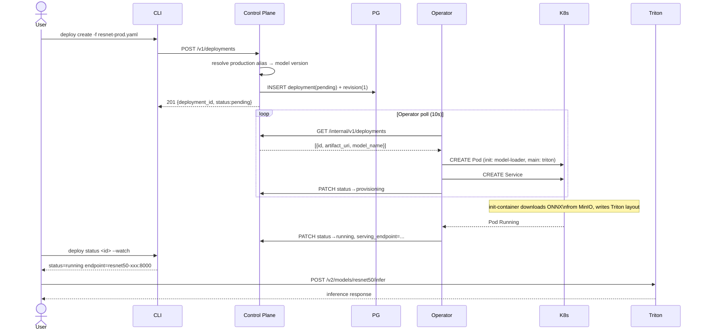

# Serving Flow

```mermaid
sequenceDiagram
    actor User
    participant CLI
    participant API as Control Plane
    participant PG
    participant Operator
    participant K8s
    participant Triton

    User->>CLI: deploy create -f resnet-prod.yaml
    CLI->>API: POST /v1/deployments
    API->>API: resolve production alias → model version
    API->>PG: INSERT deployment(pending) + revision(1)
    API-->>CLI: 201 {deployment_id, status:pending}

    loop Operator poll (10s)
        Operator->>API: GET /internal/v1/deployments
        API-->>Operator: [{id, artifact_uri, model_name}]
        Operator->>K8s: CREATE Pod (init: model-loader, main: triton)
        Operator->>K8s: CREATE Service
        Operator->>API: PATCH status→provisioning
    end

    Note over K8s: init-container downloads ONNX\nfrom MinIO, writes Triton layout
    K8s-->>Operator: Pod Running
    Operator->>API: PATCH status→running, serving_endpoint=...

    User->>CLI: deploy status <id> --watch
    CLI-->>User: status=running endpoint=resnet50-xxx:8000

    User->>Triton: POST /v2/models/resnet50/infer
    Triton-->>User: inference response
```
