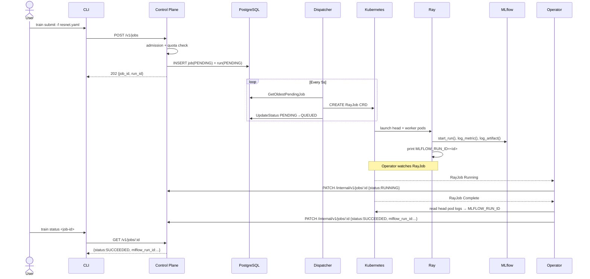

# Training Flow

```mermaid
sequenceDiagram
    actor User
    participant CLI
    participant API as Control Plane
    participant PG as PostgreSQL
    participant Disp as Dispatcher
    participant K8s as Kubernetes
    participant Ray
    participant MLflow

    User->>CLI: train submit -f resnet.yaml
    CLI->>API: POST /v1/jobs
    API->>API: admission + quota check
    API->>PG: INSERT job(PENDING) + run(PENDING)
    API-->>CLI: 202 {job_id, run_id}

    loop Every 5s
        Disp->>PG: GetOldestPendingJob
        Disp->>K8s: CREATE RayJob CRD
        Disp->>PG: UpdateStatus PENDING→QUEUED
    end

    K8s->>Ray: launch head + worker pods
    Ray->>MLflow: start_run(), log_metric(), log_artifact()
    Ray->>Ray: print MLFLOW_RUN_ID=<id>

    Note over K8s,Ray: Operator watches RayJob
    K8s-->>Operator: RayJob Running
    Operator->>API: PATCH /internal/v1/jobs/:id {status:RUNNING}

    K8s-->>Operator: RayJob Complete
    Operator->>K8s: read head pod logs → MLFLOW_RUN_ID
    Operator->>API: PATCH /internal/v1/jobs/:id {status:SUCCEEDED, mlflow_run_id:...}

    User->>CLI: train status <job-id>
    CLI->>API: GET /v1/jobs/:id
    API-->>CLI: {status:SUCCEEDED, mlflow_run_id:...}
```
