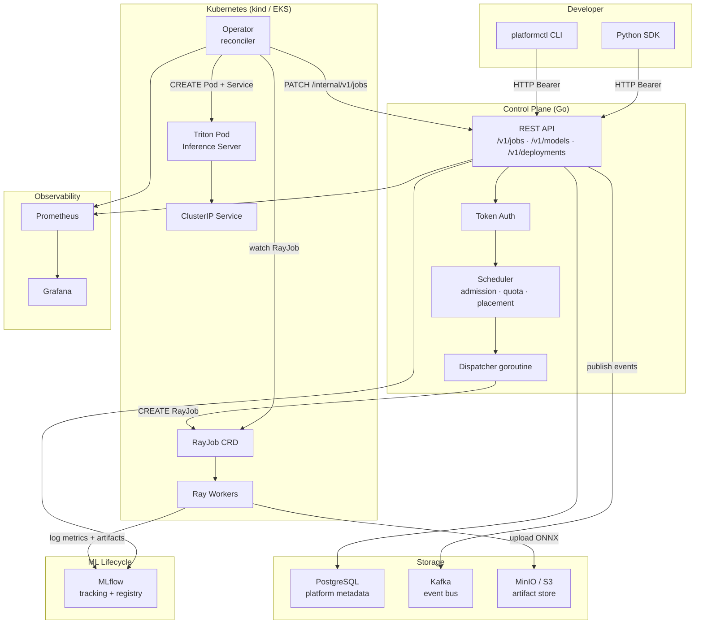
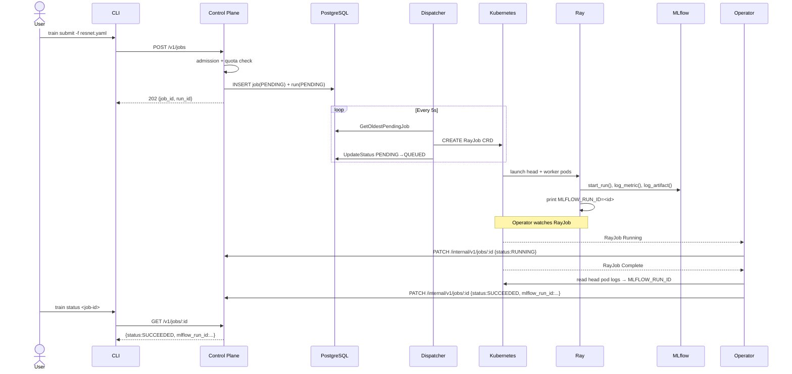
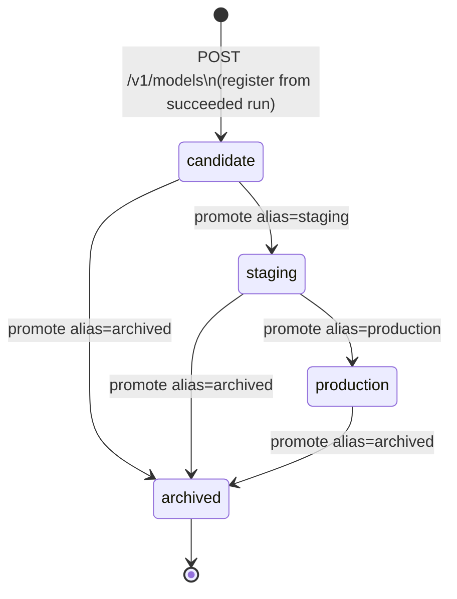
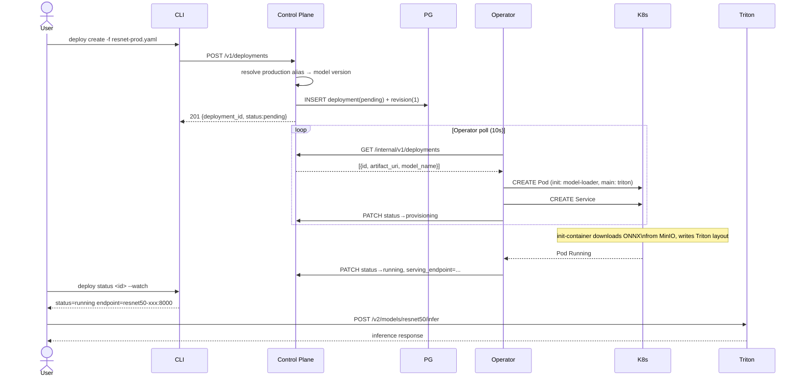

# Phase 5 — Polish Implementation Plan

> **For agentic workers:** REQUIRED SUB-SKILL: Use superpowers:subagent-driven-development (recommended) or superpowers:executing-plans to implement this plan task-by-task. Steps use checkbox (`- [ ]`) syntax for tracking.

**Goal:** Deliver a portfolio-quality Phase 5: `platformctl` CLI, Python SDK, training runtime scripts, full live-stack demo (asciinema-ready), architecture diagrams, runbooks, and a Go E2E integration test.

**Architecture:** Demo-first build order — write the demo script skeleton first, then build everything the demo calls. CLI is a standalone Go module with human-readable output and `--json` flag. The operator is extended to read Ray head pod logs and extract `MLFLOW_RUN_ID` at job completion. Training scripts print `MLFLOW_RUN_ID=<id>` to stdout. `make local-up` already creates the kind cluster; this plan adds KubeRay operator install and a `make demo-images` target.

**Tech Stack:** Go 1.26 + cobra v1 + gopkg.in/yaml.v3 (CLI); Python 3.11 + ray + mlflow + boto3 + torch (training); Python 3.11 + requests + dataclasses (SDK); kind + KubeRay (infra); testcontainers-go (E2E test).

---

## File Map

### New files
```
examples/demo-clients/demo.sh                          — 9-act live demo script
examples/demo-clients/record.sh                        — asciinema wrapper
examples/training-specs/resnet.yaml                    — training job YAML spec
examples/deployment-specs/resnet-prod.yaml             — deployment YAML spec

cli/go.mod
cli/main.go
cli/cmd/root.go                                        — cobra root, persistent flags
cli/cmd/client.go                                      — HTTP helper, printTable, printJSON
cli/cmd/train.go                                       — train submit + train status (--watch)
cli/cmd/model.go                                       — model register + model promote
cli/cmd/deploy.go                                      — deploy create + deploy status (--watch)
cli/cmd/client_test.go

training-runtime/base-images/Dockerfile                — python:3.11-slim + ray + mlflow + torch
training-runtime/base-images/requirements.txt
training-runtime/examples/minimal/train.py             — synthetic MLP, fast path
training-runtime/examples/minimal/Dockerfile
training-runtime/examples/minimal/requirements.txt
training-runtime/examples/resnet50/export.py           — pretrained ResNet50 → ONNX
training-runtime/examples/resnet50/Dockerfile
training-runtime/examples/resnet50/requirements.txt

sdk/python/platformclient/__init__.py
sdk/python/platformclient/client.py
sdk/python/platformclient/specs.py
sdk/python/tests/test_specs.py
sdk/python/tests/test_client.py
sdk/python/pyproject.toml

docs/architecture/overview.md
docs/architecture/training-flow.md
docs/architecture/model-lifecycle.md
docs/architecture/serving-flow.md
docs/runbooks/local-setup.md
docs/runbooks/demo-walkthrough.md
README.md
```

### Modified files
```
operator/internal/reconciler/rayjob_reconciler.go      — add mlflow_run_id extraction from pod logs
operator/cmd/operator/main.go                          — inject kubernetes.Clientset into reconciler
infra/local/Makefile                                   — add KubeRay install + demo-images target
control-plane/internal/api/e2e_test.go                 — new E2E integration test
```

---

## Task 1: Demo script skeleton

**Files:**
- Create: `examples/demo-clients/demo.sh`
- Create: `examples/demo-clients/record.sh`

- [ ] **Step 1: Write `examples/demo-clients/demo.sh` skeleton (echo stubs)**

```bash
#!/usr/bin/env bash
# examples/demo-clients/demo.sh
#
# End-to-end demo — kubernetes-native AI/ML platform.
# Prerequisites:
#   make local-up && make demo-images
#   PLATFORMCTL_HOST=http://localhost:8080 (NodePort or port-forward)
#   PLATFORMCTL_TOKEN=<seeded bearer token>
#   platformctl binary on PATH:  cd cli && go build -o platformctl . && export PATH=$PWD:$PATH
#
# Modes:
#   DEMO_MODE=fast  (default)  — synthetic MLP, ~60s
#   DEMO_MODE=full             — pretrained ResNet50 ONNX, ~30s but real model
#
# Exit codes: 0 = success, non-zero = failure (safe to use as CI gate)

set -euo pipefail

DEMO_MODE="${DEMO_MODE:-fast}"
HOST="${PLATFORMCTL_HOST:-http://localhost:8080}"
TOKEN="${PLATFORMCTL_TOKEN:?set PLATFORMCTL_TOKEN before running}"

# ── helpers ────────────────────────────────────────────────────────────────────
banner()  { echo; echo "════════════════════════════════════════"; echo "  $*"; echo "════════════════════════════════════════"; echo; }
ok()      { echo "  ✓ $*"; }
skip()    { echo "  ↷ skipping — $*"; }
pause()   { sleep "${DEMO_PAUSE:-1}"; }

has_kubectl() { command -v kubectl &>/dev/null && kubectl cluster-info &>/dev/null 2>&1; }
json_field()  { python3 -c "import sys,json; print(json.load(sys.stdin)$1)" 2>/dev/null || echo ""; }

# ── 1. Submit training job ──────────────────────────────────────────────────
banner "1. Submitting distributed training job  [DEMO_MODE=$DEMO_MODE]"
echo "TODO: implement after CLI is built"
pause

# ── 2. Ray workers ─────────────────────────────────────────────────────────
banner "2. Ray workers running on Kubernetes"
echo "TODO: implement after CLI + infra"
pause

# ── 3. MLflow run ──────────────────────────────────────────────────────────
banner "3. MLflow run — metrics and artifact"
echo "TODO: implement after CLI"
pause

# ── 4. Register model ──────────────────────────────────────────────────────
banner "4. Register model version"
echo "TODO: implement after CLI"
pause

# ── 5. Promote to production ───────────────────────────────────────────────
banner "5. Promote model alias to production"
echo "TODO: implement after CLI"
pause

# ── 6. Deploy to Triton ────────────────────────────────────────────────────
banner "6. Deploy model to Triton"
echo "TODO: implement after CLI"
pause

# ── 7. Inference ───────────────────────────────────────────────────────────
banner "7. Send inference request"
echo "TODO: implement after infra"
pause

# ── 8. Metrics + health ────────────────────────────────────────────────────
banner "8. Metrics and deployment health"
echo "TODO: implement after CLI"
pause

# ── 9. Failure + recovery ──────────────────────────────────────────────────
banner "9. Failure scenario — quota exceeded"
echo "TODO: implement after CLI"
pause

banner "Demo skeleton complete — stubs only"
```

- [ ] **Step 2: Write `examples/demo-clients/record.sh`**

```bash
#!/usr/bin/env bash
# examples/demo-clients/record.sh — record the demo with asciinema
set -euo pipefail
OUTPUT="${1:-demo-$(date +%Y%m%d-%H%M%S).cast}"
echo "Recording to $OUTPUT"
echo "Press ctrl-d or type 'exit' to stop recording."
asciinema rec "$OUTPUT" --command "bash examples/demo-clients/demo.sh"
echo "Replay with: asciinema play $OUTPUT"
```

- [ ] **Step 3: Make scripts executable**

```bash
chmod +x examples/demo-clients/demo.sh examples/demo-clients/record.sh
```

---

## Task 2: CLI — module bootstrap + root command

**Files:**
- Create: `cli/go.mod`
- Create: `cli/main.go`
- Create: `cli/cmd/root.go`

- [ ] **Step 1: Initialise Go module**

```bash
cd cli
go mod init github.com/Weilei424/kubernetes-native-ai-platform/cli
go get github.com/spf13/cobra@v1.9.1
go get gopkg.in/yaml.v3@v3.0.1
```

Expected: `cli/go.mod` and `cli/go.sum` created.

- [ ] **Step 2: Write `cli/main.go`**

```go
// cli/main.go
package main

import "github.com/Weilei424/kubernetes-native-ai-platform/cli/cmd"

func main() { cmd.Execute() }
```

- [ ] **Step 3: Write `cli/cmd/root.go`**

```go
// cli/cmd/root.go
package cmd

import (
	"fmt"
	"os"

	"github.com/spf13/cobra"
)

var (
	flagHost   string
	flagToken  string
	flagJSON   bool
)

var rootCmd = &cobra.Command{
	Use:   "platformctl",
	Short: "platformctl — kubernetes-native AI/ML platform CLI",
	Long: `platformctl is the developer interface for the kubernetes-native AI/ML platform.

Config (in precedence order):
  --host / --token flags
  PLATFORMCTL_HOST / PLATFORMCTL_TOKEN environment variables
  Default host: http://localhost:8080`,
}

func Execute() {
	if err := rootCmd.Execute(); err != nil {
		fmt.Fprintln(os.Stderr, err)
		os.Exit(1)
	}
}

func init() {
	rootCmd.PersistentFlags().StringVar(&flagHost, "host", "", "Control plane base URL (overrides PLATFORMCTL_HOST)")
	rootCmd.PersistentFlags().StringVar(&flagToken, "token", "", "API bearer token (overrides PLATFORMCTL_TOKEN)")
	rootCmd.PersistentFlags().BoolVar(&flagJSON, "json", false, "Output raw JSON instead of human-readable format")
}

// host returns the resolved control-plane base URL.
func host() string {
	if flagHost != "" {
		return flagHost
	}
	if v := os.Getenv("PLATFORMCTL_HOST"); v != "" {
		return v
	}
	return "http://localhost:8080"
}

// token returns the resolved bearer token.
func token() string {
	if flagToken != "" {
		return flagToken
	}
	return os.Getenv("PLATFORMCTL_TOKEN")
}
```

- [ ] **Step 4: Build to verify compilation**

```bash
cd cli && go build ./...
```

Expected: no errors.

---

## Task 3: CLI — shared HTTP client + tests

**Files:**
- Create: `cli/cmd/client.go`
- Create: `cli/cmd/client_test.go`

- [ ] **Step 1: Write failing tests**

```go
// cli/cmd/client_test.go
package cmd

import (
	"net/http"
	"net/http/httptest"
	"strings"
	"testing"
)

func TestBuildURL_NormalPath(t *testing.T) {
	got := buildURL("http://localhost:8080", "/v1/jobs")
	if got != "http://localhost:8080/v1/jobs" {
		t.Fatalf("got %q", got)
	}
}

func TestBuildURL_TrailingSlash(t *testing.T) {
	got := buildURL("http://localhost:8080/", "/v1/jobs")
	if got != "http://localhost:8080/v1/jobs" {
		t.Fatalf("got %q", got)
	}
}

func TestDoRequest_SetsAuthHeader(t *testing.T) {
	var gotAuth string
	srv := httptest.NewServer(http.HandlerFunc(func(w http.ResponseWriter, r *http.Request) {
		gotAuth = r.Header.Get("Authorization")
		w.WriteHeader(http.StatusOK)
		w.Write([]byte(`{}`))
	}))
	defer srv.Close()

	if _, err := doRequest("GET", srv.URL+"/v1/jobs", "mytoken", nil); err != nil {
		t.Fatal(err)
	}
	if gotAuth != "Bearer mytoken" {
		t.Fatalf("expected 'Bearer mytoken', got %q", gotAuth)
	}
}

func TestDoRequest_Returns4xxAsError(t *testing.T) {
	srv := httptest.NewServer(http.HandlerFunc(func(w http.ResponseWriter, r *http.Request) {
		w.WriteHeader(http.StatusNotFound)
		w.Write([]byte(`{"error":"not found"}`))
	}))
	defer srv.Close()

	_, err := doRequest("GET", srv.URL+"/v1/jobs/missing", "tok", nil)
	if err == nil {
		t.Fatal("expected error for 404")
	}
	if !strings.Contains(err.Error(), "HTTP 404") {
		t.Fatalf("expected HTTP 404 in error, got: %v", err)
	}
}

func TestPrintTable_Output(t *testing.T) {
	// printTable writes to stdout; just verify it doesn't panic
	printTable([][2]string{{"Status", "RUNNING"}, {"Job ID", "abc"}})
}
```

- [ ] **Step 2: Run — expect FAIL (undefined symbols)**

```bash
cd cli && go test ./cmd/... 2>&1 | head -10
```

Expected: `undefined: buildURL`, `undefined: doRequest`

- [ ] **Step 3: Write `cli/cmd/client.go`**

```go
// cli/cmd/client.go
package cmd

import (
	"bytes"
	"encoding/json"
	"fmt"
	"io"
	"net/http"
	"strings"
)

// buildURL joins host and path, stripping any trailing slash from host.
func buildURL(baseHost, path string) string {
	return strings.TrimRight(baseHost, "/") + path
}

// doRequest performs an authenticated HTTP request and returns the raw body.
// body may be nil. Returns an error for HTTP 4xx/5xx responses.
func doRequest(method, url, tok string, body io.Reader) ([]byte, error) {
	req, err := http.NewRequest(method, url, body)
	if err != nil {
		return nil, err
	}
	if tok != "" {
		req.Header.Set("Authorization", "Bearer "+tok)
	}
	if body != nil {
		req.Header.Set("Content-Type", "application/json")
	}
	resp, err := http.DefaultClient.Do(req)
	if err != nil {
		return nil, err
	}
	defer resp.Body.Close()
	raw, err := io.ReadAll(resp.Body)
	if err != nil {
		return nil, err
	}
	if resp.StatusCode >= 400 {
		return raw, fmt.Errorf("HTTP %d: %s", resp.StatusCode, strings.TrimSpace(string(raw)))
	}
	return raw, nil
}

// encodeJSON marshals v into a JSON reader for use as a request body.
func encodeJSON(v interface{}) (io.Reader, error) {
	b, err := json.Marshal(v)
	if err != nil {
		return nil, err
	}
	return bytes.NewReader(b), nil
}

// printTable prints key-value pairs in aligned columns.
func printTable(pairs [][2]string) {
	maxKey := 0
	for _, p := range pairs {
		if len(p[0]) > maxKey {
			maxKey = len(p[0])
		}
	}
	for _, p := range pairs {
		fmt.Printf("%-*s  %s\n", maxKey+1, p[0]+":", p[1])
	}
}

// printJSON pretty-prints a raw JSON byte slice to stdout.
func printJSON(raw []byte) {
	var v interface{}
	if err := json.Unmarshal(raw, &v); err != nil {
		fmt.Println(string(raw))
		return
	}
	out, _ := json.MarshalIndent(v, "", "  ")
	fmt.Println(string(out))
}

// output prints raw as JSON if --json flag is set, otherwise calls humanFn.
func output(raw []byte, humanFn func()) {
	if flagJSON {
		printJSON(raw)
	} else {
		humanFn()
	}
}
```

- [ ] **Step 4: Run tests — expect PASS**

```bash
cd cli && go test ./cmd/... -v -run "TestBuildURL|TestDoRequest|TestPrintTable"
```

Expected: all PASS.

---

## Task 4: CLI — `train` commands

**Files:**
- Create: `cli/cmd/train.go`

- [ ] **Step 1: Write `cli/cmd/train.go`**

```go
// cli/cmd/train.go
package cmd

import (
	"encoding/json"
	"fmt"
	"os"
	"time"

	"github.com/spf13/cobra"
	"gopkg.in/yaml.v3"
)

// trainSpec mirrors jobs.JobSubmitRequest for YAML/JSON round-trip.
type trainSpec struct {
	Name      string         `yaml:"name"       json:"name"`
	ProjectID string         `yaml:"project_id" json:"project_id"`
	Runtime   trainRuntime   `yaml:"runtime"    json:"runtime"`
	Resources trainResources `yaml:"resources"  json:"resources"`
}

type trainRuntime struct {
	Image   string            `yaml:"image"   json:"image"`
	Command []string          `yaml:"command" json:"command"`
	Args    []string          `yaml:"args"    json:"args"`
	Env     map[string]string `yaml:"env"     json:"env"`
}

type trainResources struct {
	NumWorkers   int    `yaml:"num_workers"   json:"num_workers"`
	WorkerCPU    string `yaml:"worker_cpu"    json:"worker_cpu"`
	WorkerMemory string `yaml:"worker_memory" json:"worker_memory"`
	HeadCPU      string `yaml:"head_cpu"      json:"head_cpu"`
	HeadMemory   string `yaml:"head_memory"   json:"head_memory"`
}

var trainCmd = &cobra.Command{
	Use:   "train",
	Short: "Manage training jobs",
}

var trainSubmitFile string

var trainSubmitCmd = &cobra.Command{
	Use:     "submit",
	Short:   "Submit a training job from a YAML spec file",
	Example: "  platformctl train submit -f examples/training-specs/resnet.yaml",
	RunE: func(cmd *cobra.Command, args []string) error {
		raw, err := os.ReadFile(trainSubmitFile)
		if err != nil {
			return fmt.Errorf("read spec: %w", err)
		}
		var spec trainSpec
		if err := yaml.Unmarshal(raw, &spec); err != nil {
			return fmt.Errorf("parse spec: %w", err)
		}
		body, err := encodeJSON(spec)
		if err != nil {
			return err
		}
		resp, err := doRequest("POST", buildURL(host(), "/v1/jobs"), token(), body)
		if err != nil {
			return err
		}
		output(resp, func() {
			var out struct {
				JobID string `json:"job_id"`
				RunID string `json:"run_id"`
			}
			json.Unmarshal(resp, &out)
			printTable([][2]string{
				{"Job ID", out.JobID},
				{"Run ID", out.RunID},
			})
		})
		return nil
	},
}

var trainWatch bool

var trainStatusCmd = &cobra.Command{
	Use:     "status <job-id>",
	Short:   "Show status of a training job",
	Args:    cobra.ExactArgs(1),
	Example: "  platformctl train status abc123\n  platformctl train status abc123 --watch",
	RunE: func(cmd *cobra.Command, args []string) error {
		fetch := func() ([]byte, error) {
			return doRequest("GET", buildURL(host(), "/v1/jobs/"+args[0]), token(), nil)
		}
		print := func(raw []byte) {
			output(raw, func() { printJobStatus(raw) })
		}
		if !trainWatch {
			raw, err := fetch()
			if err != nil {
				return err
			}
			print(raw)
			return nil
		}
		return watchPoll(fetch, func(raw []byte) bool {
			var out struct {
				Job struct{ Status string } `json:"job"`
			}
			json.Unmarshal(raw, &out)
			s := out.Job.Status
			return s == "SUCCEEDED" || s == "FAILED" || s == "CANCELLED"
		}, print)
	},
}

func printJobStatus(raw []byte) {
	var out struct {
		Job struct {
			ID     string `json:"id"`
			Name   string `json:"name"`
			Status string `json:"status"`
		} `json:"job"`
		Run struct {
			ID          string  `json:"id"`
			Status      string  `json:"status"`
			MLflowRunID *string `json:"mlflow_run_id"`
		} `json:"run"`
	}
	json.Unmarshal(raw, &out)
	pairs := [][2]string{
		{"Job ID", out.Job.ID},
		{"Name", out.Job.Name},
		{"Status", out.Job.Status},
		{"Run ID", out.Run.ID},
		{"Run Status", out.Run.Status},
	}
	if out.Run.MLflowRunID != nil && *out.Run.MLflowRunID != "" {
		pairs = append(pairs, [2]string{"MLflow Run", *out.Run.MLflowRunID})
	}
	printTable(pairs)
}

// watchPoll polls fetchFn every 5 seconds until doneFn returns true.
func watchPoll(fetchFn func() ([]byte, error), doneFn func([]byte) bool, printFn func([]byte)) error {
	for {
		raw, err := fetchFn()
		if err != nil {
			return err
		}
		fmt.Printf("[%s]\n", time.Now().Format("15:04:05"))
		printFn(raw)
		if doneFn(raw) {
			return nil
		}
		fmt.Println()
		time.Sleep(5 * time.Second)
	}
}

func init() {
	trainSubmitCmd.Flags().StringVarP(&trainSubmitFile, "file", "f", "", "Path to training spec YAML (required)")
	trainSubmitCmd.MarkFlagRequired("file")

	trainStatusCmd.Flags().BoolVar(&trainWatch, "watch", false, "Poll every 5s until terminal state")

	trainCmd.AddCommand(trainSubmitCmd, trainStatusCmd)
	rootCmd.AddCommand(trainCmd)
}
```

- [ ] **Step 2: Build and verify help**

```bash
cd cli && go build ./... && go run . train --help && go run . train submit --help
```

Expected: help text printed, no errors.

---

## Task 5: CLI — `model` commands

**Files:**
- Create: `cli/cmd/model.go`

- [ ] **Step 1: Write `cli/cmd/model.go`**

```go
// cli/cmd/model.go
package cmd

import (
	"encoding/json"
	"fmt"
	"strconv"

	"github.com/spf13/cobra"
)

var modelCmd = &cobra.Command{
	Use:   "model",
	Short: "Manage model registration and promotion",
}

var (
	modelRegRunID    string
	modelRegName     string
	modelRegArtifact string

	modelProName    string
	modelProVersion int
	modelProAlias   string
)

var modelRegisterCmd = &cobra.Command{
	Use:     "register",
	Short:   "Register a model version from a succeeded training run",
	Example: "  platformctl model register --run-id <run-id> --name resnet50",
	RunE: func(cmd *cobra.Command, args []string) error {
		payload := map[string]string{
			"run_id":     modelRegRunID,
			"model_name": modelRegName,
		}
		if modelRegArtifact != "" {
			payload["artifact_path"] = modelRegArtifact
		}
		body, err := encodeJSON(payload)
		if err != nil {
			return err
		}
		resp, err := doRequest("POST", buildURL(host(), "/v1/models"), token(), body)
		if err != nil {
			return err
		}
		output(resp, func() {
			var out struct {
				Version struct {
					VersionNumber int    `json:"version_number"`
					Status        string `json:"status"`
					ArtifactURI   string `json:"artifact_uri"`
				} `json:"version"`
			}
			json.Unmarshal(resp, &out)
			printTable([][2]string{
				{"Version", strconv.Itoa(out.Version.VersionNumber)},
				{"Status", out.Version.Status},
				{"Artifact URI", out.Version.ArtifactURI},
			})
		})
		return nil
	},
}

var modelPromoteCmd = &cobra.Command{
	Use:     "promote",
	Short:   "Promote a model version to an alias (staging, production, archived)",
	Example: "  platformctl model promote --name resnet50 --version 1 --alias production",
	RunE: func(cmd *cobra.Command, args []string) error {
		path := fmt.Sprintf("/v1/models/%s/versions/%d/promote", modelProName, modelProVersion)
		body, err := encodeJSON(map[string]string{"alias": modelProAlias})
		if err != nil {
			return err
		}
		resp, err := doRequest("POST", buildURL(host(), path), token(), body)
		if err != nil {
			return err
		}
		output(resp, func() {
			printTable([][2]string{
				{"Model", modelProName},
				{"Version", strconv.Itoa(modelProVersion)},
				{"Alias", modelProAlias},
				{"Status", "promoted"},
			})
		})
		return nil
	},
}

func init() {
	modelRegisterCmd.Flags().StringVar(&modelRegRunID, "run-id", "", "Platform run ID (required)")
	modelRegisterCmd.Flags().StringVar(&modelRegName, "name", "", "Model name (required)")
	modelRegisterCmd.Flags().StringVar(&modelRegArtifact, "artifact-path", "", "Artifact path within MLflow run (default: model/)")
	modelRegisterCmd.MarkFlagRequired("run-id")
	modelRegisterCmd.MarkFlagRequired("name")

	modelPromoteCmd.Flags().StringVar(&modelProName, "name", "", "Model name (required)")
	modelPromoteCmd.Flags().IntVar(&modelProVersion, "version", 0, "Version number (required)")
	modelPromoteCmd.Flags().StringVar(&modelProAlias, "alias", "", "Alias: staging, production, or archived (required)")
	modelPromoteCmd.MarkFlagRequired("name")
	modelPromoteCmd.MarkFlagRequired("version")
	modelPromoteCmd.MarkFlagRequired("alias")

	modelCmd.AddCommand(modelRegisterCmd, modelPromoteCmd)
	rootCmd.AddCommand(modelCmd)
}
```

- [ ] **Step 2: Build and verify help**

```bash
cd cli && go build ./... && go run . model --help
```

Expected: no errors.

---

## Task 6: CLI — `deploy` commands

**Files:**
- Create: `cli/cmd/deploy.go`

- [ ] **Step 1: Write `cli/cmd/deploy.go`**

```go
// cli/cmd/deploy.go
package cmd

import (
	"encoding/json"
	"fmt"
	"os"

	"github.com/spf13/cobra"
	"gopkg.in/yaml.v3"
)

// deploySpec mirrors deployments.CreateDeploymentRequest for YAML/JSON round-trip.
type deploySpec struct {
	Name         string `yaml:"name"          json:"name"`
	ModelName    string `yaml:"model_name"    json:"model_name"`
	ModelVersion int    `yaml:"model_version" json:"model_version"`
	Namespace    string `yaml:"namespace"     json:"namespace"`
	Replicas     int    `yaml:"replicas"      json:"replicas"`
}

var deployCmd = &cobra.Command{
	Use:   "deploy",
	Short: "Manage model serving deployments",
}

var deployCreateFile string

var deployCreateCmd = &cobra.Command{
	Use:     "create",
	Short:   "Create a deployment from a YAML spec file",
	Example: "  platformctl deploy create -f examples/deployment-specs/resnet-prod.yaml",
	RunE: func(cmd *cobra.Command, args []string) error {
		raw, err := os.ReadFile(deployCreateFile)
		if err != nil {
			return fmt.Errorf("read spec: %w", err)
		}
		var spec deploySpec
		if err := yaml.Unmarshal(raw, &spec); err != nil {
			return fmt.Errorf("parse spec: %w", err)
		}
		body, err := encodeJSON(spec)
		if err != nil {
			return err
		}
		resp, err := doRequest("POST", buildURL(host(), "/v1/deployments"), token(), body)
		if err != nil {
			return err
		}
		output(resp, func() {
			var out struct {
				Deployment struct {
					ID     string `json:"id"`
					Status string `json:"status"`
				} `json:"deployment"`
			}
			json.Unmarshal(resp, &out)
			printTable([][2]string{
				{"Deployment ID", out.Deployment.ID},
				{"Status", out.Deployment.Status},
			})
		})
		return nil
	},
}

var deployWatch bool

var deployStatusCmd = &cobra.Command{
	Use:     "status <deployment-id>",
	Short:   "Show status of a deployment",
	Args:    cobra.ExactArgs(1),
	Example: "  platformctl deploy status abc123\n  platformctl deploy status abc123 --watch",
	RunE: func(cmd *cobra.Command, args []string) error {
		fetch := func() ([]byte, error) {
			return doRequest("GET", buildURL(host(), "/v1/deployments/"+args[0]), token(), nil)
		}
		print := func(raw []byte) {
			output(raw, func() { printDeployStatus(raw) })
		}
		if !deployWatch {
			raw, err := fetch()
			if err != nil {
				return err
			}
			print(raw)
			return nil
		}
		return watchPoll(fetch, func(raw []byte) bool {
			var out struct {
				Deployment struct{ Status string } `json:"deployment"`
			}
			json.Unmarshal(raw, &out)
			s := out.Deployment.Status
			return s == "running" || s == "failed" || s == "deleted"
		}, print)
	},
}

func printDeployStatus(raw []byte) {
	var out struct {
		Deployment struct {
			ID              string `json:"id"`
			Name            string `json:"name"`
			Status          string `json:"status"`
			ServingEndpoint string `json:"serving_endpoint"`
			FailureReason   string `json:"failure_reason"`
		} `json:"deployment"`
	}
	json.Unmarshal(raw, &out)
	pairs := [][2]string{
		{"Deployment ID", out.Deployment.ID},
		{"Name", out.Deployment.Name},
		{"Status", out.Deployment.Status},
	}
	if out.Deployment.ServingEndpoint != "" {
		pairs = append(pairs, [2]string{"Endpoint", out.Deployment.ServingEndpoint})
	}
	if out.Deployment.FailureReason != "" {
		pairs = append(pairs, [2]string{"Failure", out.Deployment.FailureReason})
	}
	printTable(pairs)
}

func init() {
	deployCreateCmd.Flags().StringVarP(&deployCreateFile, "file", "f", "", "Path to deployment spec YAML (required)")
	deployCreateCmd.MarkFlagRequired("file")

	deployStatusCmd.Flags().BoolVar(&deployWatch, "watch", false, "Poll every 5s until terminal state")

	deployCmd.AddCommand(deployCreateCmd, deployStatusCmd)
	rootCmd.AddCommand(deployCmd)
}
```

- [ ] **Step 2: Build and run all CLI tests**

```bash
cd cli && go build ./... && go test ./... -v
```

Expected: binary builds, all tests PASS.

---

## Task 7: Operator — extract `mlflow_run_id` from pod logs

The operator currently reports status but never sets `mlflow_run_id`. Training scripts print `MLFLOW_RUN_ID=<id>` to stdout. The reconciler reads the Ray head pod logs after a job completes to extract this value.

**Files:**
- Modify: `operator/internal/reconciler/rayjob_reconciler.go`
- Modify: `operator/cmd/operator/main.go`

- [ ] **Step 1: Write a failing test for `extractMLflowRunID`**

Read `operator/internal/reconciler/rayjob_reconciler_test.go` lines 1-30 to see the existing test pattern, then add this test at the end of that file:

```go
func TestExtractMLflowRunIDFromLogs(t *testing.T) {
	logs := "epoch 1 loss=0.5\nMLFLOW_RUN_ID=abc123\nepoch 2 loss=0.4\n"
	got := parseMLflowRunID(logs)
	if got != "abc123" {
		t.Fatalf("expected abc123, got %q", got)
	}
}

func TestExtractMLflowRunIDFromLogs_NotFound(t *testing.T) {
	got := parseMLflowRunID("no run id here\n")
	if got != "" {
		t.Fatalf("expected empty, got %q", got)
	}
}
```

- [ ] **Step 2: Run — expect FAIL (parseMLflowRunID undefined)**

```bash
cd operator && go test ./internal/reconciler/... -run TestExtractMLflow -v 2>&1 | head -10
```

Expected: `undefined: parseMLflowRunID`

- [ ] **Step 3: Add `parseMLflowRunID` and pod log reading to `rayjob_reconciler.go`**

Add these imports to the existing import block in `operator/internal/reconciler/rayjob_reconciler.go`:
```go
"bufio"
"strings"

corev1 "k8s.io/api/core/v1"
metav1 "k8s.io/apimachinery/pkg/apis/meta/v1"
"k8s.io/client-go/kubernetes"
```

Add `KubeClient *kubernetes.Clientset` field to `RayJobReconciler`:
```go
type RayJobReconciler struct {
	client.Client
	KubeClient      *kubernetes.Clientset
	ControlPlaneURL string
	HTTPClient      *http.Client
}
```

Add these methods at the bottom of the file:

```go
// parseMLflowRunID scans log text for a line matching "MLFLOW_RUN_ID=<value>"
// and returns the value. Returns "" if not found.
func parseMLflowRunID(logs string) string {
	scanner := bufio.NewScanner(strings.NewReader(logs))
	for scanner.Scan() {
		line := strings.TrimSpace(scanner.Text())
		if strings.HasPrefix(line, "MLFLOW_RUN_ID=") {
			return strings.TrimPrefix(line, "MLFLOW_RUN_ID=")
		}
	}
	return ""
}

// extractMLflowRunID reads the Ray head pod logs for the given RayJob and
// returns the mlflow_run_id printed by the training script.
// Returns "" if the log cannot be read or the marker line is absent.
func (r *RayJobReconciler) extractMLflowRunID(ctx context.Context, obj *unstructured.Unstructured) string {
	if r.KubeClient == nil {
		return ""
	}
	clusterName, found, _ := unstructured.NestedString(obj.Object, "status", "rayClusterName")
	if !found || clusterName == "" {
		return ""
	}
	namespace := obj.GetNamespace()

	pods, err := r.KubeClient.CoreV1().Pods(namespace).List(ctx, metav1.ListOptions{
		LabelSelector: "ray.io/cluster=" + clusterName + ",ray.io/node-type=head",
	})
	if err != nil || len(pods.Items) == 0 {
		return ""
	}

	req := r.KubeClient.CoreV1().Pods(namespace).GetLogs(pods.Items[0].Name, &corev1.PodLogOptions{})
	stream, err := req.Stream(ctx)
	if err != nil {
		return ""
	}
	defer stream.Close()

	var sb strings.Builder
	buf := make([]byte, 4096)
	for {
		n, readErr := stream.Read(buf)
		if n > 0 {
			sb.Write(buf[:n])
		}
		if readErr != nil {
			break
		}
	}
	return parseMLflowRunID(sb.String())
}
```

Update `reconcile()` to call `extractMLflowRunID` and include it in `reportStatus`:

Replace the existing `if err := r.reportStatus(ctx, jobID, platformStatus, failureReason); err != nil {` call with:

```go
var mlflowRunID string
if platformStatus == "SUCCEEDED" {
    mlflowRunID = r.extractMLflowRunID(ctx, obj)
}

if err := r.reportStatus(ctx, jobID, platformStatus, failureReason, mlflowRunID); err != nil {
    slog.Error("reconciler: report status", "job_id", jobID, "status", platformStatus, "error", err)
    return ctrl.Result{}, err
}
```

Update `reportStatus` signature and body:

```go
func (r *RayJobReconciler) reportStatus(ctx context.Context, jobID, status string, failureReason *string, mlflowRunID string) error {
	payload := map[string]interface{}{
		"status": status,
	}
	if failureReason != nil {
		payload["failure_reason"] = *failureReason
	}
	if mlflowRunID != "" {
		payload["mlflow_run_id"] = mlflowRunID
	}
	b, err := json.Marshal(payload)
	if err != nil {
		return err
	}

	url := fmt.Sprintf("%s/internal/v1/jobs/%s/status", r.ControlPlaneURL, jobID)
	httpReq, err := http.NewRequestWithContext(ctx, http.MethodPatch, url, bytes.NewReader(b))
	if err != nil {
		return err
	}
	httpReq.Header.Set("Content-Type", "application/json")

	resp, err := r.HTTPClient.Do(httpReq)
	if err != nil {
		return fmt.Errorf("PATCH %s: %w", url, err)
	}
	defer resp.Body.Close()

	if resp.StatusCode == http.StatusConflict {
		return nil
	}
	if resp.StatusCode != http.StatusOK {
		return fmt.Errorf("unexpected status %d from internal API", resp.StatusCode)
	}
	return nil
}
```

- [ ] **Step 4: Update `operator/cmd/operator/main.go` to inject KubeClient**

Read the current `operator/cmd/operator/main.go` to find where `RayJobReconciler` is constructed. Add `KubeClient` injection:

```go
// After ctrl.GetConfigOrDie() / rest config is obtained:
kubeClient, err := kubernetes.NewForConfig(cfg)
if err != nil {
    setupLog.Error(err, "create kube client")
    os.Exit(1)
}

// When constructing RayJobReconciler, add:
// KubeClient: kubeClient,
```

Also add to imports: `"k8s.io/client-go/kubernetes"`

- [ ] **Step 5: Run tests**

```bash
cd operator && go test ./... && go vet ./...
```

Expected: all PASS, no vet warnings.

---

## Task 8: Training runtime — base image

**Files:**
- Create: `training-runtime/base-images/requirements.txt`
- Create: `training-runtime/base-images/Dockerfile`

- [ ] **Step 1: Write `training-runtime/base-images/requirements.txt`**

```
ray[default]==2.40.0
mlflow==2.21.3
boto3==1.38.0
torch==2.6.0+cpu
torchvision==0.21.0+cpu
onnx==1.17.0
```

- [ ] **Step 2: Write `training-runtime/base-images/Dockerfile`**

```dockerfile
# training-runtime/base-images/Dockerfile
# Base image for all platform training jobs.
# CPU-only; no GPU required for local demo.
FROM python:3.11-slim

WORKDIR /app

# System deps for torch CPU build
RUN apt-get update && apt-get install -y --no-install-recommends \
    libgomp1 curl \
    && rm -rf /var/lib/apt/lists/*

COPY requirements.txt .
RUN pip install --no-cache-dir -r requirements.txt \
    --extra-index-url https://download.pytorch.org/whl/cpu

# Verify critical imports at build time
RUN python -c "import ray, mlflow, torch, torchvision, boto3, onnx; print('imports OK')"
```

- [ ] **Step 3: Build base image to verify it compiles**

```bash
cd training-runtime/base-images
docker build -t platform/training-base:latest .
```

Expected: `imports OK` printed during build, image created. This may take several minutes on first run (torch download).

---

## Task 9: Training runtime — minimal script

**Files:**
- Create: `training-runtime/examples/minimal/requirements.txt`
- Create: `training-runtime/examples/minimal/train.py`
- Create: `training-runtime/examples/minimal/Dockerfile`

- [ ] **Step 1: Write `training-runtime/examples/minimal/requirements.txt`**

```
# inherits all deps from base image; add nothing here unless example-specific
```

- [ ] **Step 2: Write `training-runtime/examples/minimal/train.py`**

```python
# training-runtime/examples/minimal/train.py
"""
Minimal synthetic MLP trainer for platform E2E demo (DEMO_MODE=fast).
Trains a 2-layer MLP on random data for 5 epochs.
Prints MLFLOW_RUN_ID=<id> to stdout on completion for operator pickup.
"""
import os
import tempfile

import boto3
import mlflow
import ray
import torch
import torch.nn as nn


@ray.remote
def train_shard(rank: int, epochs: int = 5):
    """One training shard — runs on each Ray worker."""
    torch.manual_seed(42 + rank)
    model = nn.Sequential(nn.Linear(64, 32), nn.ReLU(), nn.Linear(32, 10))
    opt = torch.optim.SGD(model.parameters(), lr=0.01)
    criterion = nn.CrossEntropyLoss()
    losses = []
    for _ in range(epochs):
        x = torch.randn(32, 64)
        y = torch.randint(0, 10, (32,))
        opt.zero_grad()
        loss = criterion(model(x), y)
        loss.backward()
        opt.step()
        losses.append(loss.item())
    # Return state_dict as plain dict (serialisable across Ray)
    return {k: v.tolist() for k, v in model.state_dict().items()}, losses


def _upload(local_path: str, bucket: str, key: str) -> str:
    s3 = boto3.client(
        "s3",
        endpoint_url=os.environ.get("MINIO_ENDPOINT", "http://minio.aiplatform.svc.cluster.local:9000"),
        aws_access_key_id=os.environ.get("MINIO_ACCESS_KEY", "minio"),
        aws_secret_access_key=os.environ.get("MINIO_SECRET_KEY", "minio123"),
    )
    # Create bucket if needed
    try:
        s3.head_bucket(Bucket=bucket)
    except Exception:
        s3.create_bucket(Bucket=bucket)
    s3.upload_file(local_path, bucket, key)
    return f"s3://{bucket}/{key}"


def main():
    mlflow_uri = os.environ.get("MLFLOW_TRACKING_URI", "http://mlflow.aiplatform.svc.cluster.local:5000")
    mlflow.set_tracking_uri(mlflow_uri)
    mlflow.set_experiment("platform-demo")

    ray.init()

    with mlflow.start_run() as run:
        run_id = run.info.run_id

        num_workers = int(os.environ.get("NUM_WORKERS", "2"))
        futures = [train_shard.remote(rank=i) for i in range(num_workers)]
        results = ray.get(futures)

        # Worker 0's model is canonical; log average losses
        state_dict_lists, losses = results[0]
        for epoch, loss in enumerate(losses):
            mlflow.log_metric("train_loss", loss, step=epoch)

        # Reconstruct model for ONNX export
        model = nn.Sequential(nn.Linear(64, 32), nn.ReLU(), nn.Linear(32, 10))
        model.load_state_dict({k: torch.tensor(v) for k, v in state_dict_lists.items()})
        model.eval()

        with tempfile.TemporaryDirectory() as tmpdir:
            onnx_path = f"{tmpdir}/model.onnx"
            torch.onnx.export(
                model,
                torch.randn(1, 64),
                onnx_path,
                input_names=["input"],
                output_names=["output"],
                dynamic_axes={"input": {0: "batch_size"}},
                opset_version=17,
            )

            job_id = os.environ.get("PLATFORM_JOB_ID", "unknown")
            bucket = os.environ.get("MINIO_BUCKET", "models")
            _upload(onnx_path, bucket, f"models/{job_id}/model.onnx")
            mlflow.log_artifact(onnx_path, artifact_path="model")

        mlflow.log_param("model_type", "minimal_mlp")
        mlflow.log_param("num_workers", num_workers)

    ray.shutdown()

    # Signal mlflow run ID to the platform operator (reads head pod logs)
    print(f"MLFLOW_RUN_ID={run_id}", flush=True)


if __name__ == "__main__":
    main()
```

- [ ] **Step 3: Write `training-runtime/examples/minimal/Dockerfile`**

```dockerfile
# training-runtime/examples/minimal/Dockerfile
FROM platform/training-base:latest
COPY train.py /app/train.py
ENTRYPOINT ["python", "/app/train.py"]
```

- [ ] **Step 4: Build minimal image**

```bash
cd training-runtime/examples/minimal
docker build -t platform/minimal-trainer:latest .
```

Expected: build succeeds (no Python import errors).

---

## Task 10: Training runtime — ResNet50 export

**Files:**
- Create: `training-runtime/examples/resnet50/requirements.txt`
- Create: `training-runtime/examples/resnet50/export.py`
- Create: `training-runtime/examples/resnet50/Dockerfile`

- [ ] **Step 1: Write `training-runtime/examples/resnet50/requirements.txt`**

```
# inherits all deps from base image
```

- [ ] **Step 2: Write `training-runtime/examples/resnet50/export.py`**

```python
# training-runtime/examples/resnet50/export.py
"""
Pretrained ResNet50 ONNX export for platform demo (DEMO_MODE=full).
No training loop — loads weights and exports immediately (~30s).
Produces a real model suitable for Triton ONNX backend inference.
Prints MLFLOW_RUN_ID=<id> to stdout on completion.
"""
import os
import tempfile

import boto3
import mlflow
import torch
import torchvision.models as models


def _upload(local_path: str, bucket: str, key: str) -> str:
    s3 = boto3.client(
        "s3",
        endpoint_url=os.environ.get("MINIO_ENDPOINT", "http://minio.aiplatform.svc.cluster.local:9000"),
        aws_access_key_id=os.environ.get("MINIO_ACCESS_KEY", "minio"),
        aws_secret_access_key=os.environ.get("MINIO_SECRET_KEY", "minio123"),
    )
    try:
        s3.head_bucket(Bucket=bucket)
    except Exception:
        s3.create_bucket(Bucket=bucket)
    s3.upload_file(local_path, bucket, key)
    return f"s3://{bucket}/{key}"


def main():
    mlflow_uri = os.environ.get("MLFLOW_TRACKING_URI", "http://mlflow.aiplatform.svc.cluster.local:5000")
    mlflow.set_tracking_uri(mlflow_uri)
    mlflow.set_experiment("platform-demo")

    with mlflow.start_run() as run:
        run_id = run.info.run_id

        model = models.resnet50(weights=models.ResNet50_Weights.DEFAULT)
        model.eval()

        dummy = torch.randn(1, 3, 224, 224)
        with tempfile.TemporaryDirectory() as tmpdir:
            onnx_path = f"{tmpdir}/model.onnx"
            torch.onnx.export(
                model,
                dummy,
                onnx_path,
                input_names=["input"],
                output_names=["output"],
                dynamic_axes={"input": {0: "batch_size"}},
                opset_version=17,
            )

            job_id = os.environ.get("PLATFORM_JOB_ID", "unknown")
            bucket = os.environ.get("MINIO_BUCKET", "models")
            _upload(onnx_path, bucket, f"models/{job_id}/model.onnx")
            mlflow.log_artifact(onnx_path, artifact_path="model")

        # Published top-1 accuracy for ResNet50 on ImageNet
        mlflow.log_metric("top1_accuracy", 0.7671)
        mlflow.log_param("model_type", "resnet50")
        mlflow.log_param("export_format", "onnx")
        mlflow.log_param("opset_version", 17)

    print(f"MLFLOW_RUN_ID={run_id}", flush=True)


if __name__ == "__main__":
    main()
```

- [ ] **Step 3: Write `training-runtime/examples/resnet50/Dockerfile`**

```dockerfile
# training-runtime/examples/resnet50/Dockerfile
# Pre-download ResNet50 weights at build time to avoid demo delays.
FROM platform/training-base:latest
RUN python -c "import torchvision.models as m; m.resnet50(weights=m.ResNet50_Weights.DEFAULT)"
COPY export.py /app/export.py
ENTRYPOINT ["python", "/app/export.py"]
```

- [ ] **Step 4: Build resnet50 image**

```bash
cd training-runtime/examples/resnet50
docker build -t platform/resnet50-exporter:latest .
```

Expected: build succeeds, ResNet50 weights downloaded into image.

---

## Task 11: Infra — extend `make local-up` with KubeRay + demo-images

**Files:**
- Modify: `infra/local/Makefile`

- [ ] **Step 1: Read current Makefile**

Read `infra/local/Makefile` (already done — it creates the `aiplatform-local` kind cluster and deploys services as K8s manifests).

- [ ] **Step 2: Add KubeRay and demo-images targets**

Add these targets to `infra/local/Makefile` after the existing `local-up` target:

```makefile
KUBERAY_VERSION := 1.3.0

kuberay-up:
	@echo "==> Installing KubeRay operator $(KUBERAY_VERSION)..."
	helm repo add kuberay https://ray-project.github.io/kuberay-helm/ --force-update
	helm repo update
	helm upgrade --install kuberay-operator kuberay/kuberay-operator \
		--version $(KUBERAY_VERSION) \
		--namespace $(NAMESPACE) \
		--set image.tag=$(KUBERAY_VERSION)
	kubectl rollout status deployment/kuberay-operator -n $(NAMESPACE) --timeout=120s
	@echo "==> KubeRay operator ready."

demo-images:
	@echo "==> Building training images..."
	docker build -t platform/training-base:latest ../../training-runtime/base-images/
	docker build -t platform/minimal-trainer:latest ../../training-runtime/examples/minimal/
	docker build -t platform/resnet50-exporter:latest ../../training-runtime/examples/resnet50/
	@echo "==> Loading images into kind cluster $(CLUSTER_NAME)..."
	kind load docker-image platform/minimal-trainer:latest --name $(CLUSTER_NAME)
	kind load docker-image platform/resnet50-exporter:latest --name $(CLUSTER_NAME)
	@echo "==> Pre-loading Triton image..."
	docker pull nvcr.io/nvidia/tritonserver:24.01-py3-min || true
	kind load docker-image nvcr.io/nvidia/tritonserver:24.01-py3-min --name $(CLUSTER_NAME) || true
	@echo "==> Demo images ready."
```

Extend the existing `local-up` target — append `$(MAKE) kuberay-up` **after** the existing stack deployment steps, before the final status print:

```makefile
	@echo "==> Installing KubeRay operator..."
	$(MAKE) kuberay-up
```

- [ ] **Step 3: Verify `make local-up` syntax**

```bash
cd infra/local && make --dry-run local-up 2>&1 | tail -20
```

Expected: dry-run prints all steps including the kuberay-up call, no Makefile syntax errors.

---

## Task 12: Example specs

**Files:**
- Create: `examples/training-specs/resnet.yaml`
- Create: `examples/deployment-specs/resnet-prod.yaml`

- [ ] **Step 1: Write `examples/training-specs/resnet.yaml`**

```yaml
# examples/training-specs/resnet.yaml
# Training job spec for the platform demo (DEMO_MODE=fast uses minimal-trainer image).
# Adjust image tag to platform/resnet50-exporter:latest for DEMO_MODE=full.
#
# Submit with:
#   platformctl train submit -f examples/training-specs/resnet.yaml
name: resnet50-train-v1
project_id: vision-demo

runtime:
  image: platform/minimal-trainer:latest
  command: []
  args: []
  env:
    MLFLOW_TRACKING_URI: http://mlflow.aiplatform.svc.cluster.local:5000
    MINIO_ENDPOINT: http://minio.aiplatform.svc.cluster.local:9000
    MINIO_ACCESS_KEY: minio
    MINIO_SECRET_KEY: minio123
    MINIO_BUCKET: models
    NUM_WORKERS: "2"

resources:
  num_workers: 2
  worker_cpu: "1"
  worker_memory: "2Gi"
  head_cpu: "1"
  head_memory: "2Gi"
```

- [ ] **Step 2: Write `examples/deployment-specs/resnet-prod.yaml`**

```yaml
# examples/deployment-specs/resnet-prod.yaml
# Deployment spec for the resnet50 production model.
# Requires resnet50 model version 1 promoted to the production alias.
#
# Submit with:
#   platformctl deploy create -f examples/deployment-specs/resnet-prod.yaml
name: resnet50-prod
model_name: resnet50
model_version: 1
namespace: aiplatform
replicas: 1
```

---

## Task 13: Demo script — fill in real commands

**Files:**
- Modify: `examples/demo-clients/demo.sh`

Replace the entire contents of `examples/demo-clients/demo.sh` with the full implementation:

- [ ] **Step 1: Write the full demo script**

```bash
#!/usr/bin/env bash
# examples/demo-clients/demo.sh
#
# End-to-end demo — kubernetes-native AI/ML platform.
# Prerequisites:
#   make local-up && make -C infra/local demo-images
#   PLATFORMCTL_HOST=http://localhost:<nodeport>
#   PLATFORMCTL_TOKEN=<seeded bearer token>
#   platformctl binary on PATH
#
# DEMO_MODE=fast (default) — synthetic MLP, ~60s
# DEMO_MODE=full           — ResNet50 ONNX export, ~30s, real model
#
# Exit non-zero on any error — safe to use as CI gate.

set -euo pipefail

DEMO_MODE="${DEMO_MODE:-fast}"
HOST="${PLATFORMCTL_HOST:-http://localhost:8080}"
TOKEN="${PLATFORMCTL_TOKEN:?set PLATFORMCTL_TOKEN before running the demo}"
DEMO_PAUSE="${DEMO_PAUSE:-1}"

banner()  { echo; printf '%.0s═' {1..48}; echo; printf '  %s\n' "$*"; printf '%.0s═' {1..48}; echo; echo; }
ok()      { echo "  ✓ $*"; }
info()    { echo "  → $*"; }
pause()   { sleep "$DEMO_PAUSE"; }
json_val(){ python3 -c "import sys,json; d=json.load(sys.stdin); print($1)" 2>/dev/null || echo ""; }

has_kubectl() {
  command -v kubectl &>/dev/null || { echo "  ↷ kubectl not found — skipping cluster checks"; return 1; }
  kubectl cluster-info &>/dev/null 2>&1 || { echo "  ↷ cluster not reachable — skipping cluster checks"; return 1; }
}

# Pick training image based on DEMO_MODE
if [ "$DEMO_MODE" = "full" ]; then
  TRAIN_IMAGE="platform/resnet50-exporter:latest"
else
  TRAIN_IMAGE="platform/minimal-trainer:latest"
fi

# ── 1. Submit distributed training job ──────────────────────────────────────
banner "1 / 9  Submitting distributed training job  [DEMO_MODE=$DEMO_MODE]"

# Patch the image in the spec before submitting
SPEC_FILE=$(mktemp --suffix=.yaml)
sed "s|platform/minimal-trainer:latest|$TRAIN_IMAGE|" \
    examples/training-specs/resnet.yaml > "$SPEC_FILE"

SUBMIT=$(platformctl train submit -f "$SPEC_FILE" --json)
echo "$SUBMIT" | python3 -m json.tool
JOB_ID=$(echo "$SUBMIT" | json_val 'd["job_id"]')
RUN_ID=$(echo "$SUBMIT" | json_val 'd["run_id"]')
ok "Job submitted: $JOB_ID  Run: $RUN_ID"
rm -f "$SPEC_FILE"
pause

# ── 2. Ray workers ───────────────────────────────────────────────────────────
banner "2 / 9  Ray workers running on Kubernetes"
if has_kubectl; then
  info "Waiting 15s for dispatcher to schedule RayJob..."
  sleep 15
  kubectl get pods -n aiplatform -l ray.io/cluster 2>/dev/null \
    || info "No Ray pods yet — job may still be queuing"
else
  info "Skipping — kubectl not available"
fi
pause

# ── 3. Wait for job completion + show MLflow run ─────────────────────────────
banner "3 / 9  MLflow run — metrics and artifact"
info "Waiting for job to reach terminal state..."
platformctl train status "$JOB_ID" --watch
echo
MLFLOW_RUN_ID=$(platformctl train status "$JOB_ID" --json | json_val 'd["run"].get("mlflow_run_id","(not set)")')
ok "MLflow Run ID: $MLFLOW_RUN_ID"
info "MLflow UI: http://localhost:5000  (or NodePort — see make local-status)"
pause

# ── 4. Register model version ────────────────────────────────────────────────
banner "4 / 9  Register model version from run"
REGISTER=$(platformctl model register --run-id "$RUN_ID" --name resnet50 --json)
echo "$REGISTER" | python3 -m json.tool
VERSION=$(echo "$REGISTER" | json_val 'd["version"]["version_number"]')
ok "Registered resnet50 version $VERSION (status: candidate)"
pause

# ── 5. Promote to staging then production ────────────────────────────────────
banner "5 / 9  Promote model alias to production"
platformctl model promote --name resnet50 --version "$VERSION" --alias staging
ok "resnet50 v$VERSION → staging"
platformctl model promote --name resnet50 --version "$VERSION" --alias production
ok "resnet50 v$VERSION → production"
pause

# ── 6. Deploy model to Triton ────────────────────────────────────────────────
banner "6 / 9  Deploy model to Triton"
DEPLOY_SPEC=$(mktemp --suffix=.yaml)
sed "s/model_version: 1/model_version: $VERSION/" \
    examples/deployment-specs/resnet-prod.yaml > "$DEPLOY_SPEC"
DEPLOY=$(platformctl deploy create -f "$DEPLOY_SPEC" --json)
echo "$DEPLOY" | python3 -m json.tool
DEPLOY_ID=$(echo "$DEPLOY" | json_val 'd["deployment"]["id"]')
ok "Deployment created: $DEPLOY_ID"
rm -f "$DEPLOY_SPEC"
pause

# ── 7. Wait for Triton endpoint + inference ───────────────────────────────────
banner "7 / 9  Send inference request"
info "Waiting for deployment to reach 'running' state..."
platformctl deploy status "$DEPLOY_ID" --watch
echo
ENDPOINT=$(platformctl deploy status "$DEPLOY_ID" --json | json_val 'd["deployment"].get("serving_endpoint","")')

if [ -n "$ENDPOINT" ]; then
  ok "Serving endpoint: $ENDPOINT"
  info "Sending inference request..."
  if [ "$DEMO_MODE" = "full" ]; then
    INPUT_SHAPE='[1,3,224,224]'
    INPUT_COUNT=150528
  else
    INPUT_SHAPE='[1,64]'
    INPUT_COUNT=64
  fi
  ZEROS=$(python3 -c "print([0.0]*$INPUT_COUNT)")
  curl -sf -X POST "http://${ENDPOINT}/v2/models/resnet50/infer" \
    -H "Content-Type: application/json" \
    -d "{\"inputs\":[{\"name\":\"input\",\"shape\":${INPUT_SHAPE},\"datatype\":\"FP32\",\"data\":${ZEROS}}]}" \
    | python3 -m json.tool \
    && ok "Inference request succeeded" \
    || info "Inference request sent (check Triton logs if no response)"
else
  info "Endpoint not yet available — check: platformctl deploy status $DEPLOY_ID"
fi
pause

# ── 8. Metrics and deployment health ─────────────────────────────────────────
banner "8 / 9  Metrics and deployment health"
platformctl deploy status "$DEPLOY_ID"
echo
info "Prometheus metrics available at http://localhost:30090 (or NodePort)"
info "Grafana dashboards at http://localhost:30300  (anonymous admin)"
info "Key metrics:"
info "  http_request_duration_seconds    — API latency"
info "  platform_deployment_count        — active deployments"
info "  operator_reconcile_errors_total  — operator health"
pause

# ── 9. Failure scenario: quota exceeded ──────────────────────────────────────
banner "9 / 9  Failure scenario — quota exceeded + recovery"
info "Submitting a job with excessive resources to trigger quota rejection..."
BIGSPEC=$(mktemp --suffix=.yaml)
cat > "$BIGSPEC" <<'YAML'
name: quota-overflow-test
project_id: vision-demo
runtime:
  image: platform/minimal-trainer:latest
  command: []
resources:
  num_workers: 100
  worker_cpu: "128"
  worker_memory: "512Gi"
  head_cpu: "64"
  head_memory: "256Gi"
YAML
platformctl train submit -f "$BIGSPEC" \
  && { echo "ERROR: expected quota rejection"; rm -f "$BIGSPEC"; exit 1; } \
  || ok "Correctly rejected with HTTP 422 quota_exceeded"
rm -f "$BIGSPEC"

info "Recovery — rolling back the current deployment to previous revision..."
curl -sf -X POST \
  -H "Authorization: Bearer $TOKEN" \
  -H "Content-Type: application/json" \
  -d '{}' \
  "$HOST/v1/deployments/$DEPLOY_ID/rollback" \
  | python3 -m json.tool \
  && ok "Rollback succeeded — failure_reason cleared" \
  || info "Rollback: deployment may already be at revision 1 (nothing to roll back)"

banner "Demo complete"
echo "  Full lifecycle exercised: train → track → register → promote → deploy → infer"
echo "  Job ID:        $JOB_ID"
echo "  Run ID:        $RUN_ID"
echo "  Model version: resnet50 v$VERSION (production alias)"
echo "  Deployment:    $DEPLOY_ID"
```

- [ ] **Step 2: Verify the script is executable and runs the stubs cleanly**

```bash
# Minimal smoke test — should fail fast on missing PLATFORMCTL_TOKEN but not on syntax errors
bash -n examples/demo-clients/demo.sh
```

Expected: `bash -n` (syntax check only) exits 0.

---

## Task 14: E2E Go integration test

**Files:**
- Create: `control-plane/internal/api/e2e_test.go`

- [ ] **Step 1: Write the failing test skeleton**

```go
// control-plane/internal/api/e2e_test.go
package api_test

import "testing"

func TestE2E_FullLifecycle(t *testing.T) {
	t.Skip("skeleton — implement in next step")
}
```

Run to confirm it compiles:
```bash
cd control-plane && go test ./internal/api/... -run TestE2E -v 2>&1 | grep -E "SKIP|FAIL|ok"
```

Expected: `--- SKIP: TestE2E_FullLifecycle`

- [ ] **Step 2: Implement the full E2E test**

Replace the skeleton with:

```go
// control-plane/internal/api/e2e_test.go
package api_test

import (
	"bytes"
	"context"
	"encoding/json"
	"fmt"
	"net/http"
	"net/http/httptest"
	"strings"
	"testing"

	"golang.org/x/crypto/bcrypt"

	"github.com/Weilei424/kubernetes-native-ai-platform/control-plane/internal/api"
	"github.com/Weilei424/kubernetes-native-ai-platform/control-plane/internal/deployments"
	"github.com/Weilei424/kubernetes-native-ai-platform/control-plane/internal/events"
	"github.com/Weilei424/kubernetes-native-ai-platform/control-plane/internal/jobs"
	"github.com/Weilei424/kubernetes-native-ai-platform/control-plane/internal/mlflow"
	"github.com/Weilei424/kubernetes-native-ai-platform/control-plane/internal/models"
	"github.com/Weilei424/kubernetes-native-ai-platform/control-plane/internal/testutil"
)

// TestE2E_FullLifecycle drives the full metadata chain:
//   submit job → simulate SUCCEEDED (via internal API) → register model →
//   promote to staging + production → create deployment → simulate RUNNING →
//   verify serving endpoint
//
// Uses a real PostgreSQL container (testcontainers) + mock MLflow server.
// No Kubernetes, Ray, or Triton required.
func TestE2E_FullLifecycle(t *testing.T) {
	ctx := context.Background()
	pool := testutil.SetupDB(t)

	// ── Seed tenant + project + token ──────────────────────────────────────
	var tenantID, projectID string
	pool.QueryRow(ctx,
		`INSERT INTO tenants (name, cpu_quota, memory_quota)
		 VALUES ('e2e-tenant', 32000, 68719476736) RETURNING id::text`,
	).Scan(&tenantID)
	pool.QueryRow(ctx,
		`INSERT INTO projects (tenant_id, name) VALUES ($1, 'e2e-proj') RETURNING id::text`,
		tenantID,
	).Scan(&projectID)

	plaintext := "e2e-token-1234abcd"
	hash, _ := bcrypt.GenerateFromPassword([]byte(plaintext), bcrypt.MinCost)
	pool.Exec(ctx,
		`INSERT INTO api_tokens (tenant_id, token_hash, token_prefix) VALUES ($1, $2, $3)`,
		tenantID, string(hash), plaintext[:8],
	)

	// ── Mock MLflow server ─────────────────────────────────────────────────
	versionCounter := 0
	mlflowSrv := httptest.NewServer(http.HandlerFunc(func(w http.ResponseWriter, r *http.Request) {
		w.Header().Set("Content-Type", "application/json")
		path := r.URL.Path
		switch {
		case strings.Contains(path, "registered-models") && r.Method == http.MethodPost &&
			!strings.Contains(path, "versions") && !strings.Contains(path, "alias"):
			json.NewEncoder(w).Encode(map[string]interface{}{
				"registered_model": map[string]string{"name": "resnet50"},
			})
		case strings.Contains(path, "model-versions") && strings.Contains(path, "create"):
			versionCounter++
			json.NewEncoder(w).Encode(map[string]interface{}{
				"model_version": map[string]interface{}{
					"version": fmt.Sprintf("%d", versionCounter),
					"source":  "s3://models/test/model.onnx",
				},
			})
		case strings.Contains(path, "alias") && r.Method == http.MethodPost:
			w.WriteHeader(http.StatusOK)
			w.Write([]byte(`{}`))
		case strings.Contains(path, "alias") && r.Method == http.MethodGet:
			json.NewEncoder(w).Encode(map[string]interface{}{
				"model_version": map[string]interface{}{
					"version": fmt.Sprintf("%d", versionCounter),
				},
			})
		default:
			w.WriteHeader(http.StatusOK)
			w.Write([]byte(`{}`))
		}
	}))
	defer mlflowSrv.Close()

	// ── Wire services ──────────────────────────────────────────────────────
	jobStore := jobs.NewPostgresJobStore(pool)
	publisher := &events.NoOpPublisher{}
	mlflowClient := mlflow.New(mlflowSrv.URL)
	modelStore := models.NewPostgresModelStore(pool)
	modelsSvc := models.NewService(modelStore, jobStore, mlflowClient)
	deployStore := deployments.NewPostgresDeploymentStore(pool)
	deploymentsSvc := deployments.NewService(deployStore, modelStore)
	eventStore := events.NewEventStore(pool)

	pubHandler := api.NewRouter(pool, jobStore, publisher, modelsSvc, deploymentsSvc, eventStore)
	intHandler := api.NewInternalRouter(jobStore, publisher, deployStore, eventStore)

	pubSrv := httptest.NewServer(pubHandler)
	defer pubSrv.Close()
	intSrv := httptest.NewServer(intHandler)
	defer intSrv.Close()

	// ── helpers ────────────────────────────────────────────────────────────
	doPublic := func(t *testing.T, method, path string, body interface{}) *http.Response {
		t.Helper()
		var r io.Reader
		if body != nil {
			b, _ := json.Marshal(body)
			r = bytes.NewReader(b)
		}
		req, _ := http.NewRequest(method, pubSrv.URL+path, r)
		req.Header.Set("Authorization", "Bearer "+plaintext)
		if body != nil {
			req.Header.Set("Content-Type", "application/json")
		}
		resp, err := http.DefaultClient.Do(req)
		if err != nil {
			t.Fatalf("public %s %s: %v", method, path, err)
		}
		return resp
	}
	doInternal := func(t *testing.T, method, path string, body interface{}) *http.Response {
		t.Helper()
		b, _ := json.Marshal(body)
		req, _ := http.NewRequest(method, intSrv.URL+path, bytes.NewReader(b))
		req.Header.Set("Content-Type", "application/json")
		resp, err := http.DefaultClient.Do(req)
		if err != nil {
			t.Fatalf("internal %s %s: %v", method, path, err)
		}
		return resp
	}
	decode := func(t *testing.T, resp *http.Response, v interface{}) {
		t.Helper()
		defer resp.Body.Close()
		if resp.StatusCode >= 400 {
			var e map[string]string
			json.NewDecoder(resp.Body).Decode(&e)
			t.Fatalf("unexpected HTTP %d: %v", resp.StatusCode, e)
		}
		json.NewDecoder(resp.Body).Decode(v)
	}

	// ── 1. Submit job ──────────────────────────────────────────────────────
	t.Log("1. submit job")
	var submitOut struct {
		JobID string `json:"job_id"`
		RunID string `json:"run_id"`
	}
	decode(t, doPublic(t, "POST", "/v1/jobs", map[string]interface{}{
		"name": "e2e-job", "project_id": projectID,
		"runtime": map[string]interface{}{
			"image": "platform/minimal-trainer:latest", "command": []string{"python", "train.py"},
		},
		"resources": map[string]interface{}{
			"num_workers": 1, "worker_cpu": "1", "worker_memory": "2Gi",
			"head_cpu": "1", "head_memory": "2Gi",
		},
	}), &submitOut)
	if submitOut.JobID == "" || submitOut.RunID == "" {
		t.Fatal("expected job_id and run_id")
	}
	jobID, runID := submitOut.JobID, submitOut.RunID
	t.Logf("   job=%s run=%s", jobID, runID)

	// ── 2. Drive job: PENDING → QUEUED → RUNNING → SUCCEEDED ──────────────
	t.Log("2. drive job to SUCCEEDED via internal API")
	for _, s := range []string{"QUEUED", "RUNNING"} {
		resp := doInternal(t, "PATCH", "/internal/v1/jobs/"+jobID+"/status", map[string]string{"status": s})
		resp.Body.Close()
		if resp.StatusCode != http.StatusOK {
			t.Fatalf("transition to %s: HTTP %d", s, resp.StatusCode)
		}
	}
	// SUCCEEDED with mlflow_run_id
	mlflowRunID := "mlflow-e2e-run-abc"
	resp := doInternal(t, "PATCH", "/internal/v1/jobs/"+jobID+"/status", map[string]interface{}{
		"status": "SUCCEEDED", "mlflow_run_id": mlflowRunID,
	})
	resp.Body.Close()
	if resp.StatusCode != http.StatusOK {
		t.Fatalf("transition to SUCCEEDED: HTTP %d", resp.StatusCode)
	}

	// Verify mlflow_run_id is stored
	var statusOut struct {
		Job struct{ Status string } `json:"job"`
		Run struct {
			MLflowRunID *string `json:"mlflow_run_id"`
		} `json:"run"`
	}
	decode(t, doPublic(t, "GET", "/v1/jobs/"+jobID, nil), &statusOut)
	if statusOut.Job.Status != "SUCCEEDED" {
		t.Fatalf("expected SUCCEEDED, got %s", statusOut.Job.Status)
	}
	if statusOut.Run.MLflowRunID == nil || *statusOut.Run.MLflowRunID == "" {
		t.Fatal("mlflow_run_id not set on run")
	}
	t.Logf("   status=%s mlflow_run_id=%s", statusOut.Job.Status, *statusOut.Run.MLflowRunID)

	// ── 3. Register model ──────────────────────────────────────────────────
	t.Log("3. register model")
	var regOut struct {
		Version struct {
			VersionNumber int    `json:"version_number"`
			Status        string `json:"status"`
		} `json:"version"`
	}
	decode(t, doPublic(t, "POST", "/v1/models", map[string]string{
		"run_id": runID, "model_name": "resnet50",
	}), &regOut)
	if regOut.Version.VersionNumber == 0 {
		t.Fatal("expected version_number > 0")
	}
	if regOut.Version.Status != "candidate" {
		t.Fatalf("expected candidate, got %s", regOut.Version.Status)
	}
	ver := regOut.Version.VersionNumber
	t.Logf("   version=%d status=%s", ver, regOut.Version.Status)

	// ── 4. Promote: staging → production ──────────────────────────────────
	t.Log("4. promote to staging then production")
	for _, alias := range []string{"staging", "production"} {
		r := doPublic(t, "POST",
			fmt.Sprintf("/v1/models/resnet50/versions/%d/promote", ver),
			map[string]string{"alias": alias},
		)
		r.Body.Close()
		if r.StatusCode != http.StatusOK {
			t.Fatalf("promote to %s: HTTP %d", alias, r.StatusCode)
		}
	}

	// Verify production alias resolves
	var aliasOut struct {
		Version struct{ Status string } `json:"version"`
	}
	decode(t, doPublic(t, "GET", "/v1/models/resnet50/alias/production", nil), &aliasOut)
	if aliasOut.Version.Status != "production" {
		t.Fatalf("expected production, got %s", aliasOut.Version.Status)
	}
	t.Log("   production alias verified")

	// ── 5. Create deployment ───────────────────────────────────────────────
	t.Log("5. create deployment")
	var depOut struct {
		Deployment struct {
			ID     string `json:"id"`
			Status string `json:"status"`
		} `json:"deployment"`
	}
	decode(t, doPublic(t, "POST", "/v1/deployments", map[string]interface{}{
		"name": "resnet50-prod", "model_name": "resnet50",
		"model_version": ver, "namespace": "aiplatform", "replicas": 1,
	}), &depOut)
	if depOut.Deployment.ID == "" {
		t.Fatal("expected deployment id")
	}
	if depOut.Deployment.Status != "pending" {
		t.Fatalf("expected pending, got %s", depOut.Deployment.Status)
	}
	depID := depOut.Deployment.ID
	t.Logf("   deployment=%s status=%s", depID, depOut.Deployment.Status)

	// ── 6. Drive deployment to running ────────────────────────────────────
	t.Log("6. drive deployment to running via internal API")
	endpoint := "resnet50-" + depID + ".aiplatform.svc.cluster.local:8000"
	r2 := doInternal(t, "PATCH", "/internal/v1/deployments/"+depID+"/status", map[string]string{
		"status": "provisioning",
	})
	r2.Body.Close()
	r3 := doInternal(t, "PATCH", "/internal/v1/deployments/"+depID+"/status", map[string]interface{}{
		"status": "running", "serving_endpoint": endpoint,
	})
	r3.Body.Close()
	if r3.StatusCode != http.StatusOK {
		t.Fatalf("running transition: HTTP %d", r3.StatusCode)
	}

	// Verify
	var depStatusOut struct {
		Deployment struct {
			Status          string `json:"status"`
			ServingEndpoint string `json:"serving_endpoint"`
		} `json:"deployment"`
	}
	decode(t, doPublic(t, "GET", "/v1/deployments/"+depID, nil), &depStatusOut)
	if depStatusOut.Deployment.Status != "running" {
		t.Fatalf("expected running, got %s", depStatusOut.Deployment.Status)
	}
	if depStatusOut.Deployment.ServingEndpoint == "" {
		t.Fatal("expected serving_endpoint to be set")
	}
	t.Logf("   status=%s endpoint=%s", depStatusOut.Deployment.Status, depStatusOut.Deployment.ServingEndpoint)

	t.Log("E2E PASSED: train → register → promote → deploy lifecycle complete")
	_ = ctx
	_ = runID
}
```

Note: add `"io"` to the imports.

- [ ] **Step 3: Run the E2E test**

```bash
cd control-plane && go test ./internal/api/... -run TestE2E_FullLifecycle -v -timeout 120s
```

Expected:
```
=== RUN   TestE2E_FullLifecycle
    1. submit job
       job=... run=...
    2. drive job to SUCCEEDED via internal API
    3. register model
       version=1 status=candidate
    4. promote to staging then production
       production alias verified
    5. create deployment
       deployment=... status=pending
    6. drive deployment to running via internal API
       status=running endpoint=...
    E2E PASSED: train → register → promote → deploy lifecycle complete
--- PASS: TestE2E_FullLifecycle
```

- [ ] **Step 4: Run full control-plane test suite**

```bash
cd control-plane && go test ./... && go vet ./...
```

Expected: all PASS, no vet warnings.

---

## Task 15: Python SDK

**Files:**
- Create: `sdk/python/pyproject.toml`
- Create: `sdk/python/platformclient/__init__.py`
- Create: `sdk/python/platformclient/specs.py`
- Create: `sdk/python/platformclient/client.py`
- Create: `sdk/python/tests/test_specs.py`
- Create: `sdk/python/tests/test_client.py`

- [ ] **Step 1: Write `sdk/python/pyproject.toml`**

```toml
[build-system]
requires = ["setuptools>=68"]
build-backend = "setuptools.backends.legacy:build"

[project]
name = "platformclient"
version = "0.1.0"
description = "Thin Python SDK for the kubernetes-native AI/ML platform"
requires-python = ">=3.11"
dependencies = ["requests>=2.31"]

[project.optional-dependencies]
dev = ["pytest>=8", "responses>=0.25"]
```

- [ ] **Step 2: Write `sdk/python/platformclient/specs.py`**

```python
# sdk/python/platformclient/specs.py
from __future__ import annotations
from dataclasses import dataclass, field, asdict


@dataclass
class RuntimeSpec:
    image: str
    command: list[str] = field(default_factory=list)
    args: list[str] = field(default_factory=list)
    env: dict[str, str] = field(default_factory=dict)


@dataclass
class ResourceSpec:
    num_workers: int = 1
    worker_cpu: str = "1"
    worker_memory: str = "2Gi"
    head_cpu: str = "1"
    head_memory: str = "2Gi"


@dataclass
class TrainingSpec:
    """Spec for POST /v1/jobs — mirrors jobs.JobSubmitRequest."""
    name: str
    project_id: str
    runtime: RuntimeSpec
    resources: ResourceSpec = field(default_factory=ResourceSpec)

    def to_dict(self) -> dict:
        return asdict(self)


@dataclass
class DeploymentSpec:
    """Spec for POST /v1/deployments — mirrors deployments.CreateDeploymentRequest."""
    name: str
    model_name: str
    model_version: int
    namespace: str = "aiplatform"
    replicas: int = 1

    def to_dict(self) -> dict:
        return asdict(self)
```

- [ ] **Step 3: Write `sdk/python/platformclient/client.py`**

```python
# sdk/python/platformclient/client.py
from __future__ import annotations
import os
from typing import Any
import requests


class PlatformClient:
    """Thin HTTP client for the kubernetes-native AI/ML platform.

    Args:
        host: Base URL of the control plane.
              Defaults to PLATFORMCTL_HOST env var or http://localhost:8080.
        token: Bearer token.
               Defaults to PLATFORMCTL_TOKEN env var.
    """

    def __init__(self, host: str | None = None, token: str | None = None) -> None:
        self._host = (host or os.getenv("PLATFORMCTL_HOST", "http://localhost:8080")).rstrip("/")
        self._token = token or os.getenv("PLATFORMCTL_TOKEN", "")

    def _headers(self) -> dict[str, str]:
        return {"Authorization": f"Bearer {self._token}"} if self._token else {}

    def _url(self, path: str) -> str:
        return f"{self._host}{path}"

    def _raise(self, resp: requests.Response) -> None:
        if resp.status_code >= 400:
            raise requests.HTTPError(f"HTTP {resp.status_code}: {resp.text}", response=resp)

    # ── training jobs ──────────────────────────────────────────────────────

    def submit_job(self, spec: dict[str, Any]) -> dict[str, Any]:
        """POST /v1/jobs → {"job_id": ..., "run_id": ...}"""
        resp = requests.post(self._url("/v1/jobs"), json=spec, headers=self._headers())
        self._raise(resp)
        return resp.json()

    def get_job(self, job_id: str) -> dict[str, Any]:
        """GET /v1/jobs/:id → {"job": {...}, "run": {...}}"""
        resp = requests.get(self._url(f"/v1/jobs/{job_id}"), headers=self._headers())
        self._raise(resp)
        return resp.json()

    def list_jobs(self) -> list[dict[str, Any]]:
        """GET /v1/jobs → list of job dicts"""
        resp = requests.get(self._url("/v1/jobs"), headers=self._headers())
        self._raise(resp)
        return resp.json().get("jobs", [])

    # ── models ────────────────────────────────────────────────────────────

    def register_model(self, run_id: str, model_name: str, artifact_path: str = "") -> dict[str, Any]:
        """POST /v1/models → {"version": {...}}"""
        body: dict[str, Any] = {"run_id": run_id, "model_name": model_name}
        if artifact_path:
            body["artifact_path"] = artifact_path
        resp = requests.post(self._url("/v1/models"), json=body, headers=self._headers())
        self._raise(resp)
        return resp.json()

    def promote_model(self, model_name: str, version: int, alias: str) -> dict[str, Any]:
        """POST /v1/models/:name/versions/:version/promote"""
        resp = requests.post(
            self._url(f"/v1/models/{model_name}/versions/{version}/promote"),
            json={"alias": alias},
            headers=self._headers(),
        )
        self._raise(resp)
        return resp.json()

    def get_model(self, model_name: str) -> dict[str, Any]:
        """GET /v1/models/:name → {"model": {...}, "versions": [...]}"""
        resp = requests.get(self._url(f"/v1/models/{model_name}"), headers=self._headers())
        self._raise(resp)
        return resp.json()

    # ── deployments ───────────────────────────────────────────────────────

    def create_deployment(self, spec: dict[str, Any]) -> dict[str, Any]:
        """POST /v1/deployments → {"deployment": {...}}"""
        resp = requests.post(self._url("/v1/deployments"), json=spec, headers=self._headers())
        self._raise(resp)
        return resp.json()

    def get_deployment(self, deployment_id: str) -> dict[str, Any]:
        """GET /v1/deployments/:id → {"deployment": {...}}"""
        resp = requests.get(self._url(f"/v1/deployments/{deployment_id}"), headers=self._headers())
        self._raise(resp)
        return resp.json()
```

- [ ] **Step 4: Write `sdk/python/platformclient/__init__.py`**

```python
from .client import PlatformClient
from .specs import DeploymentSpec, ResourceSpec, RuntimeSpec, TrainingSpec

__all__ = ["PlatformClient", "TrainingSpec", "RuntimeSpec", "ResourceSpec", "DeploymentSpec"]
```

- [ ] **Step 5: Write `sdk/python/tests/test_specs.py`**

```python
# sdk/python/tests/test_specs.py
from platformclient.specs import DeploymentSpec, ResourceSpec, RuntimeSpec, TrainingSpec


def test_training_spec_to_dict_has_required_keys():
    spec = TrainingSpec(
        name="resnet-train", project_id="proj-1",
        runtime=RuntimeSpec(image="ghcr.io/example/trainer:latest"),
    )
    d = spec.to_dict()
    assert d["name"] == "resnet-train"
    assert d["project_id"] == "proj-1"
    assert d["runtime"]["image"] == "ghcr.io/example/trainer:latest"
    assert d["resources"]["num_workers"] == 1


def test_training_spec_runtime_defaults():
    spec = TrainingSpec(name="t", project_id="p", runtime=RuntimeSpec(image="img"))
    d = spec.to_dict()
    assert d["runtime"]["command"] == []
    assert d["runtime"]["args"] == []
    assert d["runtime"]["env"] == {}
    assert d["resources"]["worker_cpu"] == "1"


def test_deployment_spec_to_dict():
    spec = DeploymentSpec(name="resnet-prod", model_name="resnet50", model_version=1, replicas=2)
    d = spec.to_dict()
    assert d["model_name"] == "resnet50"
    assert d["model_version"] == 1
    assert d["replicas"] == 2
    assert d["namespace"] == "aiplatform"
```

- [ ] **Step 6: Write `sdk/python/tests/test_client.py`**

```python
# sdk/python/tests/test_client.py
import pytest
import responses as resp_mock
from platformclient.client import PlatformClient


BASE = "http://localhost:8080"


@resp_mock.activate
def test_submit_job_posts_and_sets_auth():
    resp_mock.add(resp_mock.POST, f"{BASE}/v1/jobs",
                  json={"job_id": "j1", "run_id": "r1"}, status=202)
    c = PlatformClient(host=BASE, token="tok")
    out = c.submit_job({"name": "t"})
    assert out["job_id"] == "j1"
    assert resp_mock.calls[0].request.headers["Authorization"] == "Bearer tok"


@resp_mock.activate
def test_get_job_returns_job_and_run():
    resp_mock.add(resp_mock.GET, f"{BASE}/v1/jobs/j1",
                  json={"job": {"id": "j1", "status": "RUNNING"}, "run": {"id": "r1"}})
    c = PlatformClient(host=BASE, token="tok")
    out = c.get_job("j1")
    assert out["job"]["status"] == "RUNNING"


@resp_mock.activate
def test_register_model():
    resp_mock.add(resp_mock.POST, f"{BASE}/v1/models",
                  json={"version": {"version_number": 1, "status": "candidate"}}, status=201)
    c = PlatformClient(host=BASE, token="tok")
    out = c.register_model(run_id="r1", model_name="resnet50")
    assert out["version"]["version_number"] == 1


@resp_mock.activate
def test_promote_model():
    resp_mock.add(resp_mock.POST, f"{BASE}/v1/models/resnet50/versions/1/promote",
                  json={"status": "ok"})
    c = PlatformClient(host=BASE, token="tok")
    out = c.promote_model("resnet50", 1, "production")
    assert out["status"] == "ok"


@resp_mock.activate
def test_create_deployment():
    resp_mock.add(resp_mock.POST, f"{BASE}/v1/deployments",
                  json={"deployment": {"id": "d1", "status": "pending"}}, status=201)
    c = PlatformClient(host=BASE, token="tok")
    out = c.create_deployment({"name": "resnet-prod"})
    assert out["deployment"]["id"] == "d1"


@resp_mock.activate
def test_http_error_raises():
    resp_mock.add(resp_mock.GET, f"{BASE}/v1/jobs/missing",
                  json={"error": "not found"}, status=404)
    c = PlatformClient(host=BASE, token="tok")
    with pytest.raises(Exception):
        c.get_job("missing")
```

- [ ] **Step 7: Install and run all SDK tests**

```bash
cd sdk/python
pip install -e ".[dev]"
python -m pytest tests/ -v
```

Expected: all 9 tests PASS.

---

## Task 16: Architecture diagrams + runbooks + README

**Files:**
- Create: `docs/architecture/overview.md`
- Create: `docs/architecture/training-flow.md`
- Create: `docs/architecture/model-lifecycle.md`
- Create: `docs/architecture/serving-flow.md`
- Create: `docs/runbooks/local-setup.md`
- Create: `docs/runbooks/demo-walkthrough.md`
- Create: `README.md`

- [ ] **Step 1: Write `docs/architecture/overview.md`**

````markdown
# System Architecture Overview



| Component | Responsibility |
|-----------|----------------|
| Control Plane (Go) | Orchestration, metadata, API, auth, scheduling |
| PostgreSQL | Durable platform metadata |
| Kafka | Async event bus |
| Ray + KubeRay | Distributed training execution |
| MLflow | Experiment tracking and model registry |
| MinIO / S3 | Artifact bytes (ONNX models, checkpoints) |
| Triton | Inference serving |
| Operator | K8s reconciliation (RayJob → run status, Triton pod → deployment status) |
````

- [ ] **Step 2: Write `docs/architecture/training-flow.md`**

````markdown
# Training Flow


````

- [ ] **Step 3: Write `docs/architecture/model-lifecycle.md`**

````markdown
# Model Lifecycle



**Promotion rules:**
- `archived` is terminal — cannot be re-promoted (returns 409)
- Promoting a version to `production` demotes the prior `production` version to `staging`
- Only `production`-aliased versions can be deployed
````

- [ ] **Step 4: Write `docs/architecture/serving-flow.md`**

````markdown
# Serving Flow


````

- [ ] **Step 5: Write `docs/runbooks/local-setup.md`**

```markdown
# Local Stack Setup

## Prerequisites

- Docker Desktop (with Kubernetes disabled — kind manages K8s)
- `kind` CLI: `brew install kind` or https://kind.sigs.k8s.io/
- `helm` CLI: `brew install helm`
- `kubectl` CLI: `brew install kubectl`
- Go 1.26+, Python 3.11+

## 1. Start the full local stack

```bash
make local-up
```

This creates the `aiplatform-local` kind cluster, deploys all services as Kubernetes workloads
(PostgreSQL, Kafka, MinIO, MLflow, Prometheus, Grafana), and installs the KubeRay operator.
Takes ~5 minutes on first run.

## 2. Build and load demo training images

```bash
make -C infra/local demo-images
```

Builds `platform/minimal-trainer` and `platform/resnet50-exporter`, loads them into kind,
and pre-pulls the Triton image. Run once before the first demo.

## 3. Run database migrations + start control plane

```bash
cd control-plane && go run ./cmd/server
```

In a second terminal:
```bash
cd operator && go run ./cmd/operator
```

## 4. Seed a demo tenant + token

```bash
kubectl exec -n aiplatform deploy/postgres -- psql -U aiplatform aiplatform <<'SQL'
INSERT INTO tenants (name, cpu_quota, memory_quota)
VALUES ('demo', 32000, 68719476736)
ON CONFLICT DO NOTHING;

INSERT INTO projects (tenant_id, name)
SELECT id, 'vision-demo' FROM tenants WHERE name='demo'
ON CONFLICT DO NOTHING;
SQL
```

Then generate a token hash and insert it (replace `<hash>` with output of
`htpasswd -bnBC 10 "" demo-token | tr -d ':\n' | sed 's/^.*\$//'`):

```bash
kubectl exec -n aiplatform deploy/postgres -- psql -U aiplatform aiplatform \
  -c "INSERT INTO api_tokens (tenant_id, token_hash, token_prefix)
      SELECT id, '<hash>', 'demo-tok' FROM tenants WHERE name='demo';"
```

## 5. Build the CLI

```bash
cd cli && go build -o platformctl . && export PATH=$PWD:$PATH
```

## 6. Set environment and verify

```bash
export PLATFORMCTL_HOST=http://localhost:<mlflow-nodeport>   # see: make -C infra/local local-status
export PLATFORMCTL_TOKEN=demo-token

curl http://localhost:8080/healthz   # {"status":"ok"}
platformctl train --help
```

## Stop the stack

```bash
make local-down
```
```

- [ ] **Step 6: Write `docs/runbooks/demo-walkthrough.md`**

```markdown
# Demo Walkthrough

Step-by-step guide for all 9 demo requirements (`PROJECT_INSTRUCTION.md §17`).

**Prerequisites:** complete `local-setup.md` first.

```bash
export PLATFORMCTL_HOST=http://localhost:8080
export PLATFORMCTL_TOKEN=demo-token
```

## Automated demo

```bash
bash examples/demo-clients/demo.sh
```

Set `DEMO_MODE=full` for the ResNet50 ONNX path (real model, real Triton inference).

## Record for portfolio

```bash
bash examples/demo-clients/record.sh demo.cast
# replay: asciinema play demo.cast
```

## Step-by-step

### 1. Submit distributed training job
```bash
platformctl train submit -f examples/training-specs/resnet.yaml
# JOB_ID=<from output>
# RUN_ID=<from output>
```

### 2. Ray workers
```bash
kubectl get pods -n aiplatform -l ray.io/cluster
```

### 3. MLflow run
```bash
platformctl train status $JOB_ID --watch
# MLflow UI: http://localhost:5000
```

### 4. Register model
```bash
platformctl model register --run-id $RUN_ID --name resnet50
# VERSION=<from output>
```

### 5. Promote to production
```bash
platformctl model promote --name resnet50 --version $VERSION --alias staging
platformctl model promote --name resnet50 --version $VERSION --alias production
```

### 6. Deploy to Triton
```bash
platformctl deploy create -f examples/deployment-specs/resnet-prod.yaml
# DEPLOY_ID=<from output>
```

### 7. Inference
```bash
platformctl deploy status $DEPLOY_ID --watch
# once running:
curl -X POST http://<endpoint>/v2/models/resnet50/infer \
  -H "Content-Type: application/json" \
  -d '{"inputs":[{"name":"input","shape":[1,64],"datatype":"FP32","data":[...]}]}'
```

### 8. Metrics
- Prometheus: http://localhost:30090
- Grafana: http://localhost:30300

### 9. Failure + recovery
```bash
# Quota exceeded:
platformctl train submit -f /dev/stdin <<'YAML'
name: overflow
project_id: vision-demo
runtime: {image: img}
resources: {num_workers: 100, worker_cpu: "128", worker_memory: "512Gi", head_cpu: "64", head_memory: "256Gi"}
YAML
# Expected: HTTP 422 quota_exceeded

# Rollback:
curl -X POST -H "Authorization: Bearer $PLATFORMCTL_TOKEN" \
  -d '{}' $PLATFORMCTL_HOST/v1/deployments/$DEPLOY_ID/rollback
```
```

- [ ] **Step 7: Write `README.md`**

```markdown
# kubernetes-native-ai-platform

A Kubernetes-native AI/ML platform for end-to-end ML workflow orchestration.

**train → track → register → promote → deploy → infer**

Signals both **AI Infrastructure** (Kubernetes orchestration, distributed training, model serving, observability) and **ML Platform** (experiment tracking, model registry, promotion workflows, developer CLI) engineering.

## Architecture

| Layer | Technology |
|-------|-----------|
| Control plane | Go (chi, PostgreSQL, Kafka) |
| Training runtime | Ray + KubeRay |
| Experiment tracking | MLflow |
| Serving | Triton Inference Server |
| Artifact store | MinIO (local) / S3 (cloud) |
| Observability | Prometheus + Grafana |
| Orchestration | Kubernetes (kind locally) |

See [`docs/architecture/`](docs/architecture/) for component and sequence diagrams.

## Quick Start

```bash
# 1. Start the full local stack (kind cluster + all services + KubeRay)
make local-up

# 2. Build demo training images (once)
make -C infra/local demo-images

# 3. Start control plane + operator (two terminals)
cd control-plane && go run ./cmd/server
cd operator && go run ./cmd/operator

# 4. Build the CLI
cd cli && go build -o platformctl . && export PATH=$PWD:$PATH

# 5. Run the end-to-end demo
export PLATFORMCTL_HOST=http://localhost:8080
export PLATFORMCTL_TOKEN=<your-token>
bash examples/demo-clients/demo.sh
```

See [`docs/runbooks/local-setup.md`](docs/runbooks/local-setup.md) for detailed setup.

## Demo

Nine-act scripted demo covering all portfolio requirements:

1. Submit distributed training job
2. Ray workers running on Kubernetes
3. MLflow run with metrics and artifact
4. Register model version
5. Promote to `production` alias
6. Deploy to Triton
7. Inference requests
8. Metrics and deployment health (Grafana)
9. Failure scenario and recovery

```bash
bash examples/demo-clients/demo.sh          # run
bash examples/demo-clients/record.sh        # record with asciinema
DEMO_MODE=full bash examples/demo-clients/demo.sh  # use real ResNet50
```

See [`docs/runbooks/demo-walkthrough.md`](docs/runbooks/demo-walkthrough.md).

## Testing

```bash
cd control-plane && go test ./...                                           # unit + integration
cd control-plane && go test ./internal/api/... -run TestE2E -v             # E2E lifecycle
cd operator && go test ./...                                                # operator tests
cd cli && go test ./...                                                     # CLI tests
cd sdk/python && python -m pytest tests/                                    # SDK tests
```

## Repository

```
control-plane/   Go REST API — orchestration, metadata, auth, scheduling
operator/        Kubernetes reconciler (RayJob + Triton)
cli/             platformctl CLI
sdk/python/      Thin Python SDK
training-runtime/ Training scripts + Docker images (minimal MLP + ResNet50)
examples/        Specs, demo script
docs/            Architecture diagrams, runbooks
infra/           kind config, Kubernetes manifests, Helm
observability/   Prometheus rules, Grafana dashboards
```
```

---

## Self-Review

**1. Spec coverage:**
- Demo script (9 acts, graceful degradation, asciinema) → Task 1 + 13 ✓
- CLI with human-readable + `--json` + `--watch` → Tasks 2–6 ✓
- Operator extended to extract `mlflow_run_id` from pod logs → Task 7 ✓
- Training base image → Task 8 ✓
- Minimal training script (DEMO_MODE=fast) → Task 9 ✓
- ResNet50 ONNX export (DEMO_MODE=full) → Task 10 ✓
- `make local-up` KubeRay extension + `make demo-images` → Task 11 ✓
- Example specs → Task 12 ✓
- E2E Go integration test → Task 14 ✓
- Python SDK + tests → Task 15 ✓
- Architecture diagrams (4 files) → Task 16 ✓
- Runbooks + README → Task 16 ✓

**2. Placeholder scan:** No TBD/TODO placeholders found. All code blocks complete.

**3. Type consistency:**
- `trainSpec` fields match `jobs.JobSubmitRequest` JSON tags ✓
- `deploySpec` fields match `deployments.CreateDeploymentRequest` JSON tags ✓
- `models.RegisterRequest` uses `run_id` + `model_name` → CLI sends both ✓
- `models.PromoteRequest` uses `alias` → CLI sends `{"alias": ...}` ✓
- `models.NewService(store, runReader, mlflowClient)` — E2E test calls `models.NewService(modelStore, jobStore, mlflowClient)` ✓ (jobStore implements RunReader)
- `api.NewInternalRouter(store, publisher, deploymentStore, eventStore)` — no pool param ✓
- `events.NoOpPublisher{}` (not a constructor call) ✓
- `mlflow.New(trackingURI)` (not `mlflow.NewClient`) ✓
- `testutil.SetupDB(t)` (not `NewTestDB`) ✓
- `watchPoll` defined in `train.go` and called from `deploy.go` — both are in package `cmd` ✓

**Risk flag — `io` import in E2E test:** The `doPublic` helper uses `io.Reader` — add `"io"` to imports.

**Risk flag — deployment state machine:** The E2E test drives `pending → provisioning → running`. Verify `deployments.ValidTransition("pending", "provisioning")` is a valid transition by reading `control-plane/internal/deployments/statemachine.go` before executing Task 14.
